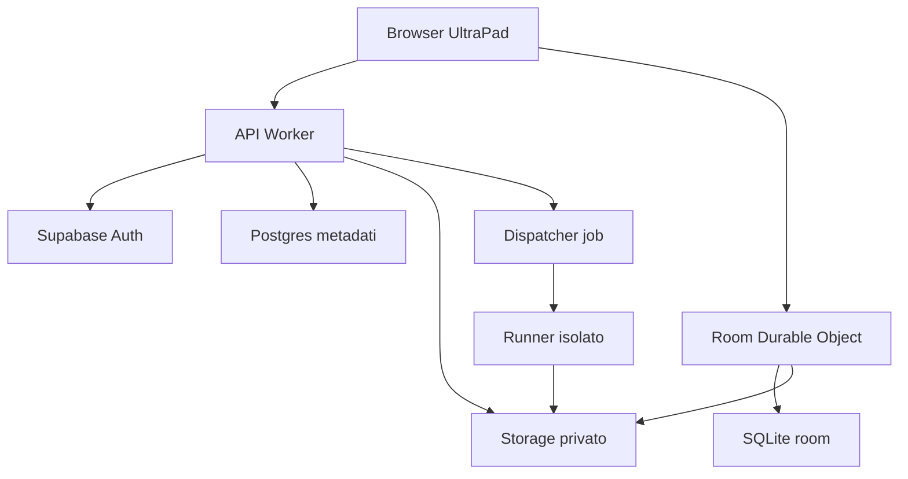
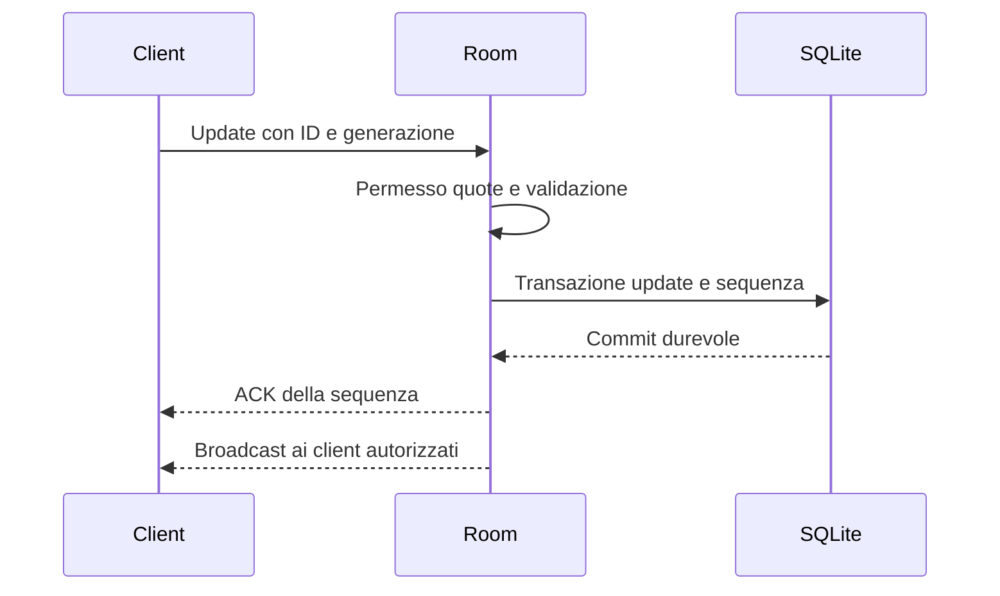

# UltraPad

## Software Design Document per lo sviluppo con Codex

**Versione:** 1.0  
**Data:** 2 ottobre 2026  
**Committente:** Simone Rega  
**Stato:** proposta implementabile; nessun servizio o account provisionato  
**Nome di lavoro:** UltraPad; da verificare prima dell'uso pubblico  
**Lingua dell'interfaccia iniziale:** italiano, con infrastruttura per inglese  
**Destinatari:** Codex, sviluppatore responsabile, futuri collaboratori tecnici

Questo documento definisce una web app collaborativa per scrivere note e documenti, modificare codice, organizzare idee su una lavagna e lavorare a progetti e tesi. Il risultato atteso è un prodotto realmente utilizzabile da un piccolo gruppo, con salvataggio durevole, controllo degli accessi ed esportazione dei dati. La prima release si concentra sull'editor di testo e codice condiviso; documenti strutturati, lavagna, conversioni Office, compilazione LaTeX ed esecuzione remota entrano attraverso fasi successive con criteri di accettazione espliciti.

L'architettura proposta usa React e TypeScript nel browser, Yjs per la collaborazione, un backend leggero su Cloudflare Workers e Durable Objects, Supabase per identità e metadati relazionali. Il contenuto collaborativo ha un'unica autorità di persistenza per documento. Si evitano microservizi generalizzati, un IDE completo scritto da zero e promesse di compatibilità universale con qualsiasi file.

**Come usarlo con Codex:** salvare questo file in `docs/SDD.md`, leggere le decisioni dei capitoli 6 e 7, poi eseguire il prompt del capitolo 30. Codex deve completare una milestone verificabile alla volta. Questo SDD è una specifica di progetto, non la certificazione che un'integrazione sia già stata sviluppata, testata o finanziata.

---

## Indice

1. Visione e proposta di valore
2. Assunzioni e confini
3. Utenti e casi d'uso
4. Requisiti funzionali
5. Requisiti non funzionali
6. Tecnologie e decisioni architetturali
7. Architettura del sistema
8. Modello dei file e compatibilità
9. Modello dati e vincoli
10. Identità autorizzazione e condivisione
11. Collaborazione e protocollo
12. Persistenza versioni e recupero
13. Editor di testo e codice
14. Documenti strutturati e tesi
15. Lavagna e collegamenti
16. Esecuzione dei linguaggi
17. LaTeX e generazione PDF
18. Importazione esportazione e ricerca
19. Interfaccia e accessibilità
20. API e contratti
21. Sicurezza e gestione dei dati
22. Distribuzione e ambienti
23. Costi quote e sostenibilità
24. Osservabilità e operazioni
25. Strategia di test
26. Roadmap e backlog
27. Struttura del repository
28. Decisioni ADR
29. Rischi e questioni aperte
30. Istruzioni operative per Codex
31. Checklist di rilascio
32. Fonti e glossario

## 1 Visione e proposta di valore

### 1.1 Problema

Uno sviluppatore o studente passa spesso tra editor di codice, app per note, documenti condivisi, lavagne e strumenti per compilare una tesi. File e discussioni vengono duplicati, i collegamenti perdono contesto e non è chiaro quale versione sia stata usata per produrre un risultato.

UltraPad riunisce questi lavori nello stesso progetto. L'utente può collegare una nota a un file Java, inserire entrambi nella lavagna, discutere una porzione di testo e generare un output da una revisione identificabile. La metafora di Discord riguarda spazi, membri e presenza; non implica riprodurne chat vocale, streaming o infrastruttura multimediale.

### 1.2 Differenziazione proposta

Le funzioni distintive sono ipotesi di prodotto, da validare con utenti reali:

- **File come oggetti condivisi:** la stessa risorsa appare nell'albero e nella lavagna tramite riferimenti al suo ID, senza copie del contenuto.
- **Scrittura e codice nello stesso contesto:** editor specializzati, permessi comuni, commenti ancorati e versioni navigabili.
- **Progetti riproducibili:** un'esecuzione o un PDF dichiara le revisioni sorgente, il runtime e gli asset usati.
- **Percorso per una tesi:** capitoli, formule, bibliografia e allegati collegati al progetto.
- **Portabilità:** esportazione dei file sorgente e di un manifesto aperto, senza richiedere UltraPad per leggerli.
- **Collaborazione con recupero:** si distingue ciò che è salvato localmente da ciò che il server ha confermato.

Non si assume che l'app sia nuova sul mercato solo per questa combinazione. Prima di investire in funzioni costose, testare se riduce concretamente il passaggio tra strumenti.

### 1.3 Metriche di prodotto

Obiettivi sperimentali per la beta, non promesse commerciali:

| Metrica | Obiettivo iniziale | Misurazione |
|---|---|---|
| Primo file condiviso | entro 5 minuti dall'accesso | sessione di usabilità |
| Ritorno al progetto | almeno 3 gruppi su 5 tornano in una settimana | osservazione consensuale |
| Recupero del lavoro | ogni test di crash recupera tutti gli update confermati | test automatico |
| Portabilità | progetto esportato leggibile fuori dall'app | test ZIP e file |
| Comprensione del salvataggio | utenti distinguono locale e server | test di usabilità |

## 2 Assunzioni e confini

### 2.1 Ipotesi di partenza

Il proprietario del progetto sviluppa inizialmente da solo con Codex. La beta è destinata a 5–20 collaboratori conosciuti, con al massimo 10 editor nello stesso documento. Il riferimento principale è un computer desktop; il mobile permette lettura, commenti e modifiche semplici. I progetti contengono prevalentemente testo e piccoli allegati.

Si vuole partire con una spesa ricorrente infrastrutturale prossima a zero, accettando i limiti dei piani gratuiti. Una beta che ospita lavoro importante deve avere backup controllati. Un servizio pubblico affidabile può richiedere un budget maggiore. I costi di sviluppo e manutenzione esistono anche quando l'hosting è gratuito.

ChatGPT Plus e l'accesso a Codex aiutano a sviluppare, nei limiti del piano. Non vanno trattati come hosting o credito API per gli utenti della futura app. La fatturazione ChatGPT e API è separata [S14]. L'AI integrata nel prodotto è facoltativa e fuori dal percorso critico iniziale.

### 2.2 Ambito della prima release utilizzabile

La release R1 include login, workspace, progetti, cartelle, file testuali, editor Monaco, collaborazione simultanea, presenza, ruoli viewer/editor/admin/owner, inviti tramite link, cronologia di checkpoint, recupero dopo disconnessione, download ed esportazione ZIP. Supporta estensioni come TXT, MD, JSON, XML, HTML, CSS, JS, TS, Java, C# e TEX come testo. Le funzioni offerte per ciascun linguaggio sono descritte nel capitolo 8.

La release R1 non esegue Java o C#, non converte DOC legacy, non promette impaginazione Word e non compila una tesi LaTeX. Queste funzioni hanno milestone proprie: non si mostrano pulsanti che simulano risultati.

### 2.3 Esclusioni iniziali

Videochiamate, chat vocale, plugin arbitrari caricati dagli utenti, marketplace, IDE con debugger completo, sincronizzazione bidirezionale del filesystem locale, compatibilità con tutte le estensioni VS Code, file binari modificabili in modo universale, anonimato in scrittura, crittografia end to end e accessi pubblici indicizzabili sono fuori ambito iniziale.

La cifratura end to end cambierebbe ricerca server, conversioni, compilazioni e gestione delle chiavi. Non va dichiarata se i server devono leggere i file.

### 2.4 Convenzioni normative

**DEVE** indica un requisito bloccante della milestone interessata. **DOVREBBE** indica una scelta consigliata, derogabile tramite ADR motivato. **PUÒ** indica una possibilità successiva. P0 è essenziale per R1, P1 appartiene alla release successiva, P2 è un'espansione.

## 3 Utenti e casi d'uso

### 3.1 Profili

| Profilo | Bisogno | Percorso principale |
|---|---|---|
| Sviluppatore | appunti, snippet, configurazioni condivise | progetto → file → editor |
| Studente | capitoli, formule, bibliografia | progetto tesi → documento → export |
| Gruppo di lavoro | decisioni e collegamenti tra risorse | lavagna → file → commenti |
| Revisore | feedback senza modificare il testo | progetto → commento → risoluzione |
| Proprietario | invitare, proteggere, esportare | membri → ruoli → backup |

### 3.2 Flussi che devono funzionare

**UC01 Note collaborative.** Simone crea un progetto e un file `idee.md`, invita un collaboratore, entrambi scrivono nello stesso testo. Gli inserimenti convergono, i cursori sono distinguibili e il testo resta disponibile dopo la chiusura dei browser.

**UC02 Revisione di codice.** Un editor apre `Main.java`, un viewer lo legge, un commenter annota un intervallo. Il viewer non può aggirare il ruolo inviando update WebSocket. Il codice è scaricabile anche senza runtime Java configurato.

**UC03 Connessione interrotta.** L'utente continua a scrivere offline. L'app mostra salvataggio locale. Al ritorno online, verifica i permessi, sincronizza gli update e passa a salvato sul server solo dopo l'ACK durevole.

**UC04 Permesso revocato mentre si lavora offline.** La sincronizzazione viene negata; le modifiche locali sono esportabili dall'utente ma non reinserite nel documento condiviso. Si spiega che l'accesso è cambiato.

**UC05 Tesi.** In R2/R3 un progetto contiene capitoli, immagini e bibliografia. L'utente produce una compilazione LaTeX da uno snapshot del progetto; i log mostrano file e righe d'errore. L'output è associato alla revisione utilizzata.

**UC06 Lavagna.** Un utente trascina una scheda che punta a una nota, crea un collegamento a un file e aggiunge un commento. Rinominare il file non rompe la scheda. Cancellarlo produce un riferimento mancante leggibile.

**UC07 Importazione Office.** Un file DOCX viene conservato come originale e convertito in un nuovo documento interno; il report segnala elementi non mantenuti. Il sistema non sovrascrive silenziosamente l'originale con una versione semplificata.

**UC08 Esportazione e abbandono del servizio.** Il proprietario scarica un archivio con file, asset, manifesto e documenti convertibili. I riferimenti interni vengono descritti nel manifesto; nessun file essenziale richiede un servizio proprietario per essere decodificato.

## 4 Requisiti funzionali

| ID | Priorità | Requisito | Accettazione sintetica |
|---|---|---|---|
| FR01 | P0 | accesso OAuth e logout | sessione scaduta e logout gestiti |
| FR02 | P0 | workspace e progetti | creazione e cancellazione autorizzate |
| FR03 | P0 | albero di cartelle e file | spostamenti senza cicli e duplicati |
| FR04 | P0 | testo e codice | edit, undo locale, find, download |
| FR05 | P0 | collaborazione | 3 browser convergono dopo offline |
| FR06 | P0 | presenza e cursori | utenti online distinti, scadenza presenza |
| FR07 | P0 | permessi lato server | viewer bloccato anche via protocollo |
| FR08 | P0 | inviti con scadenza | invito monouso e bound all'identità |
| FR09 | P0 | persistenza e ACK | crash non perde update confermati |
| FR10 | P0 | checkpoint e restore | restore produce nuova generazione |
| FR11 | P0 | import/export testo e ZIP | archivio consistente e sicuro |
| FR12 | P0 | offline documenti già aperti | nessuna perdita silenziosa |
| FR13 | P1 | commenti ancorati | spostamento testo mantiene anchor |
| FR14 | P1 | Markdown con preview | preview sanificata senza script |
| FR15 | P1 | documenti strutturati | Tiptap condiviso con schema versionato |
| FR16 | P1 | formule matematiche | sorgente e rendering disponibili |
| FR17 | P1 | lavagna | schede, nodi, archi, pan, zoom |
| FR18 | P1 | backlink | file rinominato mantiene riferimenti |
| FR19 | P1 | ricerca | risultati filtrati per accesso |
| FR20 | P1 | JS e Python locali | isolamento e interruzione verificati |
| FR21 | P2 | Java e C# remoti | sandbox dedicata e quote |
| FR22 | P2 | LaTeX completo | PDF, log, manifesto sorgente |
| FR23 | P2 | import DOCX RTF DOC | capacità dichiarate per formato |
| FR24 | P2 | profilo tesi | capitoli, bibliografia, template |
| FR25 | P2 | integrazione Git | export o commit esplicito, conflitti visibili |
| FR26 | P2 | assistenza AI | opt in, diff, costi e provider visibili |

Il supporto TXT e le altre estensioni testuali appartiene a FR04. DOC, RTF e DOCX sono requisiti espliciti FR23: fino a quel momento l'app conserva gli originali come allegati scaricabili, senza presentarli come documenti nativamente modificabili.

## 5 Requisiti non funzionali

### 5.1 Prestazioni e scala iniziale

I valori seguenti sono budget di progetto da misurare su hardware desktop medio, RTT verso il servizio fino a 100 ms e documenti entro le quote. Non sono SLA del provider.

| ID | Obiettivo | Metodo |
|---|---|---|
| NFR01 | input locale normalmente entro 50 ms | profiling editor |
| NFR02 | update remoto p95 entro 500 ms | timestamp test in 3 browser |
| NFR03 | documento testuale da 200 KiB apribile entro 2 s con cache calda | benchmark ripetibile |
| NFR04 | ACK durevole p95 entro 1 s in beta | metriche protocollo |
| NFR05 | 10 editor su documento da 1 MiB | test carico e memoria |
| NFR06 | nessuna perdita di update già confermato in crash simulati | fault injection |
| NFR07 | ripristino backup entro 4 h in beta | esercitazione documentata |

Caricare Monaco, Tiptap, lavagna e runtime soltanto quando necessari. In particolare Pyodide e compilatori non fanno parte del bundle iniziale. L'app deve restare navigabile se una funzionalità opzionale fallisce.

### 5.2 Compatibilità e accessibilità

Supportare le due versioni stabili più recenti di Chrome, Edge, Firefox e Safari al momento del rilascio, con matrice test registrata. Su mobile usare layout semplificato; eventuali limiti dell'editor devono essere dichiarati nella UI. Monaco non equivale a un'app mobile completa [S6].

Obiettivo di accessibilità: livello AA delle WCAG 2.2, verificato con test automatici e controllo manuale dei flussi principali; riferimento ufficiale [S18]. Shortcut, navigazione da tastiera, focus, alternative alla lavagna e testo per gli stati di salvataggio devono essere progettati, non aggiunti alla fine.

### 5.3 Manutenibilità

TypeScript strict; contratti validati a runtime; migrazioni versionate; dipendenze bloccate nel lockfile; nessun segreto client; adapter per storage, identità e realtime; moduli con dipendenze dirette esplicite. Non imporre percentuali di coverage arbitrarie: tutti i percorsi di accesso, salvataggio, revoca e recupero devono avere test sostanziali.

### 5.4 Affidabilità

Una scritta “salvato” deve corrispondere a uno stato definito. Non basta che un update sia stato inviato sul socket o broadcast agli altri utenti. Il server deve aver completato la transazione durevole. Il salvataggio locale non garantisce sopravvivenza alla cancellazione dei dati del browser o all'evizione dello storage.

## 6 Tecnologie e decisioni architetturali

### 6.1 Stack consigliato

| Area | Scelta | Motivazione e confine |
|---|---|---|
| frontend | React, TypeScript, Vite | SPA interattiva, build statica e lazy loading |
| routing | React Router | URL stabili per progetto e file |
| UI | Tailwind CSS e primitive accessibili | velocità, componenti posseduti dal progetto |
| stato server | TanStack Query | cache e invalidazioni dei metadati |
| stato locale UI | Zustand, se utile | pannelli, tab, preferenze; non copia del contenuto |
| editor testo/codice | Monaco Editor | editing e integrazioni linguistiche disponibili |
| editor documenti | Tiptap open source su ProseMirror | schema strutturato e binding collaborativo |
| collaborazione | Yjs e y-protocols | CRDT e binding degli editor |
| Monaco condiviso | y-monaco | integrazione Y.Text/Monaco [S7] |
| lavagna | React Flow con modello Yjs applicativo | nodi e archi, controllo dei riferimenti |
| backend HTTP | Hono su Cloudflare Workers | API piccole e validazione centrale |
| realtime | Durable Objects SQLite e WebSocket Hibernation | autorità di una room per documento |
| identità | Supabase Auth | OAuth e gestione delle identità |
| metadati | Postgres Supabase | vincoli relazionali e politiche RLS |
| file binari | Supabase Storage in R1 | meno servizi nella prima release |
| storage esteso | adapter Cloudflare R2 | alternativa dopo misurazione di quota/costi |
| offline | IndexedDB, binding Yjs e outbox dedicata | contenuto locale e update non confermati |
| formule | KaTeX | rendering di formule, non compilazione di tesi |
| Python | Pyodide su origine isolata | esecuzione locale con limitazioni |
| remoto | runner separato con sandbox forte | Java, C#, LaTeX e conversioni |
| test | Vitest, Testing Library, Playwright | unità, componenti, browser multipli |
| CI | GitHub Actions o equivalente | build e check ripetibili con quote |

Scegliere release stabili compatibili durante M0; questo documento non inventa numeri di versione. Codex deve registrare versioni, licenze e documentazione consultata in `docs/DEPENDENCIES.md`. Non aggiornare dipendenze automaticamente durante una milestone.

### 6.2 Alternative considerate

**Next.js:** valido se in futuro serve una parte pubblica SEO o rendering server. Lo spazio di lavoro è una SPA con editor pesanti; una build Vite evita complessità SSR non necessaria. La landing page può essere separata.

**Backend Java Spring o .NET:** compatibile con l'esperienza di Simone. Per questa prima app, TypeScript end to end riduce contratti duplicati e si integra con Yjs. Le conoscenze Java/C# sono preziose nel runner, ma non obbligano ad aggiungere un secondo backend applicativo.

**Hocuspocus su VPS:** alternativa concreta al provider Durable Objects se il gate M0 fallisce. Offre un percorso Node per Yjs, ma richiede macchina persistente, aggiornamenti, backup e gestione WebSocket. La stima VPS del capitolo 23 è un budget da quotare, non un'offerta verificata. Non mantenere due provider produttivi nella prima release.

**Supabase Realtime per ogni battitura:** possibile implementando persistenza e autorizzazione adeguate, ma non adottato. Broadcast non risolve da solo la durabilità CRDT; il fanout può consumare quote. Nella proposta Supabase Realtime non è il trasporto degli editor.

**tldraw:** funzionalmente interessante, ma il suo SDK richiede una licenza per produzione secondo le condizioni attuali [S11]. Per minimizzare dipendenze economiche si sceglie React Flow, il cui core è MIT [S10], accettando di implementare il comportamento della lavagna. React Flow non è una copia pronta di Miro.

**ONLYOFFICE/Collabora:** possibili per una futura compatibilità Office avanzata. Aggiungono servizio, memoria, licenze e integrazione di sicurezza. Non sono dipendenze iniziali. Qualunque adozione richiede un ADR e verifica delle condizioni della versione scelta.

### 6.3 Gate di fattibilità prima dell'interfaccia completa

M0 deve dimostrare: sincronizzazione Yjs su Durable Objects; connessioni hibernatable; ricostruzione del documento da SQLite dopo eviction; ACK successivo al commit; rifiuto degli update da viewer; supporto del documento massimo senza superare CPU/memoria del piano scelto; revoca di una sessione attiva.

Il provider edge è una parte specialistica da implementare e verificare. Le primitive Cloudflare non costituiscono un backend Yjs pronto. Se ricostruzione e validazione non rientrano nelle quote gratuite, usare Workers Paid oppure l'alternativa Hocuspocus, registrando costi e motivazione. Non sacrificare persistenza o controllo accessi per rimanere a zero euro.

## 7 Architettura del sistema

### 7.1 Componenti e responsabilità



Il browser accede direttamente a Supabase Auth per i flussi supportati. Le altre operazioni di progetto passano dall'API. Il WebSocket della room usa un ticket applicativo, verificato dal backend, invece di una credenziale inserita in un URL permanente.

### 7.2 Autorità dei dati

| Dato | Autorità | Repliche o derivati |
|---|---|---|
| identità e sessioni | Supabase Auth | profilo applicativo |
| workspace, file, ACL, job | Postgres | cache frontend |
| contenuto collaborativo attivo | SQLite del Durable Object | Y.Doc client, checkpoint storage |
| allegati originali | storage privato | download e preview |
| presenza | memoria/protocollo room | indicatori client |
| indice di ricerca | proiezione derivata | ricostruibile dal contenuto |
| export e PDF | artefatti immutabili | riferimenti in Postgres |

Non salvare il testo corrente contemporaneamente in una colonna Postgres e in un documento Yjs come due verità modificabili. L'eventuale `search_text` è una proiezione con numero di revisione, mai il contenuto da ricaricare nell'editor.

### 7.3 Monolite modulare

Il backend logico è un monolite modulare: identity, workspaces, projects, files, collaboration, history, assets, search, jobs. Le room sono unità di coordinamento dello stesso prodotto. Il runner ha un confine separato per motivi di sicurezza e runtime, non per applicare microservizi ovunque.

Non introdurre Kubernetes, Kafka, un cluster Redis, service mesh, event sourcing generalizzato o Elasticsearch all'avvio. Una outbox Postgres mirata è giustificata per revoche, proiezioni e lavori asincroni.

### 7.4 Confini di consistenza

Metadati e permessi hanno transazioni Postgres. Gli update del contenuto hanno transazioni SQLite della room. Le operazioni che attraversano entrambi usano stato esplicito, outbox, idempotenza e riconciliazione; non si presume una transazione distribuita.

Esempi: creazione file con stato `initializing`, inizializzazione room e passaggio a `ready`; eliminazione con `deleting`, blocco accessi e pulizia asincrona; checkpoint caricato nello storage prima di pubblicarne il puntatore. Gli oggetti orfani sono individuati e rimossi dal job di manutenzione.

## 8 Modello dei file e compatibilità

### 8.1 Principio

Un'estensione non identifica automaticamente un modello di editing o un runtime. `file_kind`, formato d'origine, modalità editor e capacità disponibili sono campi distinti.

| Formato | Editing R1 | Analisi/preview | Esecuzione o conversione futura |
|---|---|---|---|
| TXT, LOG | testo semplice | ricerca | nessun runtime |
| MD | sorgente testo | preview R2 sanificata | export HTML/PDF limitato |
| JSON | testo | parse e diagnostica | format esplicito |
| XML | testo | evidenziazione, parser sicuro | schema XSD opzionale |
| HTML/CSS | testo | preview isolata R2 | script solo nel sandbox |
| JS/TS | testo | servizi Monaco compatibili | JS locale; TS transpilation esplicita |
| JAVA | testo | sintassi; nessuna promessa IntelliSense JVM | compilazione/esecuzione remota R3 |
| CS | testo | sintassi; nessuna promessa Roslyn completa | compilazione/esecuzione remota R3 |
| PY | testo | sintassi | Pyodide R2 o runner successivo |
| TEX/BIB | testo | formule e sintassi limitate | compilazione LaTeX R3 |
| documento interno | non R1 | struttura Tiptap R2 | HTML/JSON/MD parziale, DOCX R3 |
| DOCX | allegato originale | conversione R3 con report | editing della copia normalizzata |
| DOC | allegato originale | conversione legacy R3 | niente apertura come plain text |
| RTF | allegato originale | parser/conversione R3 | perdita formattazione possibile |
| PDF | allegato | lettura con viewer isolato | non word processor PDF |
| immagini | allegato | preview controllata | nessun editing universale |
| estensione sconosciuta | testo solo se decodificabile | fallback manuale | binario come allegato |

L'evidenziazione sintattica non equivale a linting, compilazione, debugging o IntelliSense completo. Monaco è un editor, non l'intero VS Code [S6].

### 8.2 Modelli canonici

- `text`: Y.Text denominato `content`; linguaggio e line ending nei metadati.
- `rich_document`: Y.XmlFragment denominato `body`, schema ProseMirror versionato.
- `board`: Y.Map di nodi e archi con sottostrutture per proprietà collaborative.
- `asset`: bytes immutabili nello storage; nuova revisione sostituisce il riferimento.
- `folder`: solo metadati; non ha room di contenuto.

I documenti ricchi non sono proiezioni bidirezionali automatiche di DOCX o Markdown. Convertire crea una nuova risorsa con `derived_from_file_id` e report. Una vista “sorgente” per un documento ricco deve essere inizialmente in sola lettura; una modifica diretta del JSON strutturato richiede validazione e una transazione controllata.

### 8.3 Encoding e integrità

Testo canonico Unicode, export UTF-8 per default. Import UTF-8 e UTF-16 con BOM; per codifiche ambigue chiedere la scelta nell'interfaccia e mostrare anteprima. Non affermare rilevamento perfetto. Conservare original encoding, BOM, LF/CRLF e bytes originali quando necessario per round trip.

Senza modifiche, offrire download dell'originale. Dopo editing, offrire export nel formato dichiarato e segnalare caratteri non rappresentabili. Normalizzare il testo interno a LF; mantenere separatamente la preferenza di export. Hash SHA-256 sui bytes degli originali e degli artefatti; per la convergenza testare anche la rappresentazione canonica del contenuto.

### 8.4 Quote iniziali di prodotto

| Limite | R1 proposta | Comportamento |
|---|---|---|
| file testuale collaborativo | 1 MiB UTF-8 | oltre: download/anteprima limitata |
| allegato | 10 MiB | rifiuto prima e dopo upload |
| spazio workspace | 100 MiB | contatore incluse revisioni e asset |
| file per progetto | 500 | creazione bloccata con spiegazione |
| editor simultanei per documento | 10 | ulteriori sessioni in lettura o rifiutate |
| nodi board R2 | 1.000 | quota e avviso |
| update frame | 64 KiB | paste grandi suddivisi dal provider |
| checkpoint CRDT | 8 MiB | soglia da validare in M0 |

Quote configurabili lato server, senza possibilità per il client di elevarle. Il limite testo visibile e quello stato CRDT sono separati: molte cancellazioni possono far crescere la struttura interna. Il protocollo deve supportare invio a chunk dello stato iniziale entro un limite aggregato.

## 9 Modello dati e vincoli

### 9.1 Entità relazionali

Tutti gli ID pubblici sono UUID generati dal server. Tutti i timestamp sono `timestamptz` UTC; rendering nel fuso dell'utente. Gli ID non sostituiscono le verifiche di autorizzazione.

| Tabella | Campi essenziali | Vincoli |
|---|---|---|
| profiles | user_id, display_name, locale | user_id univoco collegato all'identità |
| workspaces | id, name, owner_id, acl_version, status | owner sempre membro attivo |
| workspace_members | workspace_id, user_id, role, status | PK composta |
| projects | id, workspace_id, name, status, created_by | FK workspace |
| project_members | project_id, workspace_id, user_id, role | grant consentito soltanto a membri workspace |
| files | id, workspace_id, project_id, parent_id, kind, name, name_key, ext, language, generation, schema_version, metadata_version, status, deleted_at | parent nella stessa coppia workspace/progetto |
| file_assets | id, file_id, workspace_id, storage_key, sha256, size_bytes, mime, revision | key privata, FK file scoped |
| document_checkpoints | id, file_id, generation, server_seq, storage_key, checksum, label, created_by | revisioni immutabili |
| project_snapshots | id, project_id, manifest_key, status, created_by | manifesto immutabile |
| invitations | id, workspace_id, project_id, email_key, role, token_hash, expires_at, used_at | token hash, transazione per consumo |
| comments | id, file_id, generation, author_id, anchor_json, body, state | anchor e testo validati |
| share_links | id, resource_id, token_hash, expires_at, revoked_at | lettura soltanto; futura |
| jobs | id, workspace_id, project_id, type, snapshot_id, state, attempt, lease_until, runtime_id, requested_by | nessun sorgente corrente implicito |
| job_artifacts | id, job_id, storage_key, sha256, kind, expires_at | autorizzati tramite job |
| file_links | from_file_id, to_file_id, workspace_id, relation | no collegamenti cross tenant |
| search_documents | file_id, generation, server_seq, text_projection, search_vector | proiezione sostituibile |
| audit_events | id, workspace_id, actor_id, action, target_id, occurred_at, detail | dati minimizzati |
| outbox_events | id, aggregate_id, type, payload, attempts, next_attempt_at | retry e idempotenza consumer |
| quota_reservations | id, workspace_id, kind, amount, expires_at, status | riserva atomica per upload/job |

### 9.2 Vincoli che Codex deve implementare

Le FK composite `(parent_id, workspace_id, project_id)` e `(file_id, workspace_id)` impediscono riferimenti tra tenant. I metadati privilegiano questi vincoli rispetto alle sole verifiche nell'API. Un parent deve essere una cartella viva. Uno spostamento acquisisce un lock di progetto, controlla antenati tramite query ricorsiva e impedisce cicli.

`name_key` è il nome normalizzato NFC e case folded; duplicati per parent/progetto sono vietati anche nella root. Implementare unicità root con `NULLS NOT DISTINCT` se disponibile, oppure indice dedicato per parent nullo. Rifiutare NUL, slash, backslash, `.` e `..`; il nome è un'etichetta, non un percorso OS. Non normalizzare silenziosamente due nomi in uno solo.

`metadata_version` implementa optimistic concurrency per rename e move. `generation` appartiene al contenuto e cambia soltanto per restore/reset/migrazioni incompatibili. Cancellazione e recupero devono mantenere coerenti cartelle e discendenti.

La rimozione dell'ultimo owner è vietata. Il trasferimento ownership è una transazione che aggiorna proprietario e ruoli. Gli inviti non possono conferire più autorità di quella del mittente. Un membro sospeso non mantiene accessi tramite `project_members`.

### 9.3 Schema locale della room

```sql
CREATE TABLE room_meta (
  singleton INTEGER PRIMARY KEY CHECK (singleton = 1),
  file_id TEXT NOT NULL,
  generation INTEGER NOT NULL,
  schema_version INTEGER NOT NULL,
  last_seq INTEGER NOT NULL,
  snapshot_seq INTEGER NOT NULL,
  snapshot_blob BLOB,
  snapshot_sha256 TEXT,
  status TEXT NOT NULL
);

CREATE TABLE updates (
  seq INTEGER PRIMARY KEY,
  update_id TEXT NOT NULL UNIQUE,
  actor_id TEXT NOT NULL,
  client_instance_id TEXT NOT NULL,
  update_blob BLOB NOT NULL,
  created_at_ms INTEGER NOT NULL
);

CREATE TABLE dedup_receipts (
  update_id TEXT PRIMARY KEY,
  seq INTEGER NOT NULL,
  actor_id TEXT NOT NULL,
  payload_sha256 TEXT NOT NULL,
  expires_at_ms INTEGER NOT NULL
);
```

DDL illustrativo da tradurre nella storage API della versione Cloudflare scelta. Persistenza, recovery e transazioni devono essere testati sulla piattaforma reale. Le receipts sopravvivono alla compattazione per una finestra proposta di 30 giorni; duplicati più vecchi restano innocui rispetto al contenuto grazie a Yjs, ma possono ricevere un nuovo numero di sequenza.

## 10 Identità autorizzazione e condivisione

### 10.1 Autenticazione

R1 usa OAuth GitHub e, se configurato, Google. Evita inizialmente di dipendere da email magic link e da un SMTP da gestire. Tutti gli inviti sono link generati nell'app: nessuna email automatica nella prima milestone. L'utente può copiarli e inviarli personalmente.

L'API verifica firma JWT, issuer, audience, expiry e subject tramite JWKS Supabase; supporta rotazione delle chiavi e retry limitato su `kid` sconosciuto [S12]. Non accetta un JWT solo perché decodificabile. Il client usa il flusso supportato dalla SDK e PKCE ove previsto; URL redirect esatti per ciascun ambiente.

In caso di errore di identità, fail closed. La modalità locale senza cloud è disponibile soltanto in development, chiaramente identificata e impossibile da abilitare accidentalmente nella build production.

### 10.2 Ruoli

| Azione | Viewer | Commenter | Editor | Admin | Owner |
|---|---|---|---|---|---|
| leggere e scaricare | sì | sì | sì | sì | sì |
| commentare R2 | no | sì | sì | sì | sì |
| modificare contenuto | no | no | sì | sì | sì |
| creare file e cartelle | no | no | sì | sì | sì |
| rename/move/delete file | no | no | sì | sì | sì |
| creare checkpoint | no | no | sì | sì | sì |
| restore distruttivo del file | no | no | no | sì | sì |
| invitare membri | no | no | no | sì | sì |
| gestire ruoli editor e inferiori | no | no | no | sì | sì |
| gestire admin e ownership | no | no | no | no | sì |
| eliminare workspace | no | no | no | no | sì |

Owner/admin workspace vedono tutti i progetti. Per gli altri utenti l'accesso iniziale al progetto richiede un grant `project_members`. Il ruolo workspace pone il limite massimo; quello progetto può ridurlo. La combinazione produce una funzione deterministica `effectivePermission`, condivisa come logica di dominio e implementata nelle policy SQL. Nessun ACL per cartella in R1, così l'ereditarietà non diventa ambigua.

### 10.3 RLS e backend

Tabelle tenant e bucket privati devono avere RLS attiva. Le operazioni normali dell'API si eseguono nel contesto JWT dell'utente mediante PostgREST/RPC. Le mutazioni atomiche complesse usano RPC SQL controllate. Le funzioni `SECURITY DEFINER`, se necessarie, hanno `search_path` fisso, grant minimi e controlli espliciti dell'identità.

Una credenziale privilegiata è riservata a job interni, revoche e manutenzione. Non deve aggirare i controlli dei percorsi HTTP ordinari. Testare RLS mediante chiamate dirette: non basta testare i controller.

### 10.4 Inviti e revoca

Token casuale con almeno 128 bit di entropia, memorizzato solo come hash; durata proposta 72 ore. L'accettazione richiede login, match dell'email verificata quando l'invito è indirizzato a una persona e consumo atomico monouso. Mostrare progetto e ruolo prima di accettare. Non mettere il token nei log o negli eventi analytics.

La revoca aggiorna `acl_version` e inserisce un evento outbox nella stessa transazione Postgres. Il consumer invalida le room conosciute e chiude i socket. Ogni socket ha inoltre una lease di autorizzazione non superiore a 60 secondi; dopo scadenza una scrittura richiede riverifica, anche se l'evento push non è arrivato. Anche le consegne in uscita richiedono una lease valida: un reader silenzioso non deve continuare a ricevere nuovi contenuti dopo la scadenza senza riverifica. Un controllo API indisponibile non prolunga automaticamente la lease. Le room registrano la propria presenza in un registro a TTL per il push; il limite di lease copre registrazioni perse e room ibernate.

Obiettivo: revoca normalmente immediata tramite push, limite residuo massimo 60 secondi per scritture già connesse. Questo compromesso va comunicato nella documentazione operativa. Per una garanzia sincrona dopo la revoca serve un coordinamento più forte e un diverso costo di controllo.

## 11 Collaborazione e protocollo

### 11.1 Modello CRDT

Un Y.Doc per file condiviso; un documento distinto per la board. Non usare un unico Y.Doc per tutto il workspace: distribuirebbe informazioni non necessarie, renderebbe pesanti gli accessi e complicherebbe permessi e recovery.

Yjs gestisce convergenza di update duplicati e riordinati [S5]. Non gestisce automaticamente autenticazione, backup, quote, semantica del dominio o undo delle modifiche altrui. Non sostituire CRDT con invio dell'intero testo ad ogni keypress.

### 11.2 Accesso alla room

1. Il client apre il file via API e ottiene metadati, ruolo e generazione.
2. `POST /files/{id}/collaboration-ticket` verifica i permessi e crea un ticket monouso di 30 secondi.
3. Il ticket permette solo l'upgrade verso quella room, generazione e identità.
4. Il Worker inoltra alla room un'identità interna autenticata, non header scelti dal browser.
5. La room registra identità, permesso, `acl_version` e scadenza della lease nell'attachment del socket.
6. Il client esegue handshake e sincronizzazione; il server invia stato autorizzato e cursori effimeri.

Preferire ticket nel primo messaggio se il socket può essere aperto senza far circolare segreti nell'URL; in tal caso nessuno stato viene inviato prima dell'autenticazione. Se necessario per routing/upgrade usare ticket query monouso, con redazione obbligatoria di URL nei log e `Referrer-Policy: no-referrer`. Il ticket non contiene il JWT originale.

### 11.3 Envelope applicativo

```ts
type ClientEnvelope =
  | { type: 'hello'; protocol: 1; fileId: string; generation: number }
  | { type: 'sync-request'; stateVector: Uint8Array }
  | { type: 'update'; updateId: string; clientInstanceId: string;
      generation: number; payload: Uint8Array }
  | { type: 'awareness'; payload: Uint8Array }
  | { type: 'refresh-auth'; ticket: string };

type ServerEnvelope =
  | { type: 'sync-state'; generation: number; serverSeq: number;
      payload: Uint8Array }
  | { type: 'ack'; updateId: string; generation: number; serverSeq: number }
  | { type: 'remote-update'; serverSeq: number; payload: Uint8Array }
  | { type: 'permission-changed'; role: string }
  | { type: 'generation-changed'; generation: number }
  | { type: 'error'; code: string; retryable: boolean };
```

Envelope logico; per i bytes usare codifica binaria documentata, non array JSON di numeri. Definire protocol version, limite frame, limite stato aggregato, ordine dei chunk, timeout di assemblaggio e checksum. Non mescolare senza documentazione messaggi custom con i frame standard `y-protocols`.

Il provider custom deve preservare le proprietà Yjs senza accettare update nascosti nei messaggi sync da un viewer. `sync step 2` può trasportare contenuto: ogni percorso che applica bytes al documento è un percorso di scrittura e richiede `canEdit`.

### 11.4 Percorso di scrittura



La room serializza la pipeline applicativa degli update e delle operazioni di restore. Non presumere che la sola esistenza di un Durable Object renda atomiche tutte le interazioni asincrone con servizi esterni. Una receipt associa update ID, identità e hash del payload: la stessa chiave con attore o bytes diversi viene rifiutata, senza confermare falsamente il nuovo contenuto. Generare update ID casuali ad alta entropia e documentare il namespace.

Validare dimensione, schema e limiti su un documento candidato o un meccanismo equivalente testato, prima di accettare un update che può rompere lo schema. Dopo commit applicare al documento in memoria; se l'applicazione in memoria fallisce, marcare la room da ricostruire prima di elaborare altro. Una failure dello storage produce nessun ACK e nessun broadcast. Il client mantiene l'update nell'outbox.

La copia candidata costa memoria/CPU: è oggetto del benchmark M0. Se troppo costosa, ridurre la quota, passare al piano adeguato o cambiare provider. Non eliminare la validazione degli update non fidati.

### 11.5 Presenza e undo

Awareness contiene colore, ID sessione, nome derivato dal server e selezione; è effimera e non è contenuto [S8]. Non può modificare ruolo o identità. Limitare a circa 10 messaggi/s per sessione, aggregare movimenti del cursore e rimuovere utenti dopo timeout/disconnect. Dopo hibernation, ricostruire presenza dagli attachment o richiederla ai client; non riscrivere cursori continuamente in SQLite.

Undo locale via Y.UndoManager con `trackedOrigins` per sessione. In Tiptap usare la cronologia della collaborazione e disabilitare l'undo concorrente non compatibile, secondo la versione adottata [S9]. Lo storico dei checkpoint non è l'undo della sessione.

### 11.6 Offline e conflitti

Usare cache IndexedDB per file già aperti, con namespace `(userId, fileId, generation)`, e outbox per update ID non confermati. Al reconnect verificare ruolo e generazione prima di inviare scritture. Retry con backoff e jitter, limite di tentativi prima di avviso persistente.

Stati UI: `locale`, `sincronizzazione`, `salvato sul server`, `offline`, `accesso cambiato`, `errore salvataggio`. Visualizzare l'ultimo ACK e una descrizione accessibile. Un client non deve cancellare l'outbox perché vede testo apparentemente uguale sul server.

Se la generazione è cambiata, non applicare automaticamente gli update vecchi. Offrire export locale o creazione di una copia nel progetto solo dopo verifica dell'accesso. Se il file è stato cancellato offline, la modifica locale non lo resuscita. Rename e move offline non sono supportati in R1.

Logout chiude socket, svuota cache in memoria e separa completamente i dati tra account. Prima di cancellare un'outbox con lavoro non confermato, offrire esportazione o annullamento del logout. Di default rimuovere la cache locale dell'utente al logout; un'eventuale opzione di conservazione sul dispositivo richiede una scelta esplicita. La revoca server non può cancellare copie già scaricate da un dispositivo offline: non promettere questa proprietà.

## 12 Persistenza versioni e recupero

### 12.1 Caricamento e compattazione

La room viene identificata deterministicamente da file e generazione. All'avvio carica snapshot binario e update con sequenza successiva a `snapshot_seq`. Gli attachment dei socket conservano solo dati piccoli di autorizzazione/sessione, mai l'intero Y.Doc.

Compattazione proposta dopo 200 update o 1 MiB di log, da affinare con benchmark. Generare `encodeStateAsUpdate` completo, scrivere snapshot e sequenza nella stessa transazione e cancellare soltanto update coperti. La compattazione non cambia generazione e non ricrea il documento dal solo testo visibile: perdere gli identificatori CRDT romperebbe reconnect e riferimenti.

Hibernation richiede che non restino timer o strutture operative che tengono la room attiva inutilmente [S4]. Usare gli alarm per manutenzione differita; evitare heartbeat persistenti lato server. La presenza riappare dai client dopo la ricostruzione.

### 12.2 Checkpoint durevoli

I checkpoint nominati e quelli automatici periodici vengono caricati nello storage privato con generazione, server sequence, checksum, schema e versione delle librerie rilevanti. Pubblicare il puntatore Postgres solo dopo upload riuscito. Non cancellare snapshot precedente o log necessari prima che il nuovo checkpoint sia verificato.

Politica proposta R1: checkpoint automatico al massimo ogni 15 minuti per file attivo modificato, fino a 20 checkpoint automatici per file; checkpoint nominati entro quota workspace. L'ACK SQLite non è una garanzia che il checkpoint esterno sia già presente.

### 12.3 Snapshot di progetto

Una snapshot di progetto congela lista file, metadati e revisioni/asset. Per R1 può rappresentare un **taglio per file**, acquisito in istanti vicini e dichiarato nel manifesto, non una transazione globale contemporanea. Un export o job usa esclusivamente questo manifesto, mai letture successive dei file correnti.

Se serve una snapshot realmente coerente tra file, introdurre una barriera: lock breve sulle mutazioni dei metadati, flush di ogni room, raccolta revisioni, completamento manifest e rilascio. Le scritture durante la barriera vengono accodate o esplicitamente bloccate. Il suo costo va misurato; non si promette atomicità globale senza implementarla.

### 12.4 Restore

Restore distruttivo soltanto admin/owner. Processo:

1. Acquisire lock del file e impostare `restoring`; vietare nuovi ticket di scrittura.
2. Creare checkpoint di sicurezza dello stato corrente; fermarsi se non riesce.
3. Preparare nuova room con generazione incrementata e contenuto scelto.
4. Pubblicare puntatore/generazione e stato ready in una transazione Postgres.
5. Chiudere socket vecchi e notificare generazione cambiata.
6. I client aprono la nuova room; gli update vecchi restano recuperabili localmente.

La procedura è idempotente e riprende dallo stato persistito. Nessuna vecchia room può ricevere nuovi ticket dopo il cambio; le lease già aperte vengono invalidate, con il limite di revoca dichiarato. Per casi delicati preferire “ripristina come nuovo file”, disponibile agli editor.

### 12.5 Backup e perdita ammessa

Distinguere guasto di processo, corruzione logica e perdita del provider. Obiettivo RPO zero per update confermati durante crash/eviction della room entro le garanzie dello storage. Obiettivo beta per disaster recovery esterno: RPO massimo 24 ore per metadati e 15 minuti per contenuti attivi se il checkpoint automatico è funzionante; eventuali failure devono essere allarmate.

Un backup nello stesso provider non copre tutti i rischi. Prima di affidare tesi o lavoro importante al servizio, programmare copia cifrata indipendente di Postgres, manifesti, asset e checkpoint, con ripristino mensile di prova. Gli export manuali non sono un sostituto permanente di backup automatici.

Il piano Supabase Free non include backup automatici gestiti [S1]. R1 deve quindi implementare backup esterni tramite un ambiente fidato e pianificato, oppure passare a un piano adeguato. La configurazione del backup è un prerequisito della beta con dati importanti.

## 13 Editor di testo e codice

### 13.1 Funzioni R1

Tab multiple, albero file, minimappa opzionale, numeri di riga, ricerca/sostituzione nel file, word wrap, indentazione, selezioni multiple, matching parentesi, zoom, palette comandi, download e indicatori di presenza. Le preferenze individuali non vengono sincronizzate nel documento.

Un unico model Monaco per `(fileId, generation)` per sessione, condiviso tra viste se necessario. Al cambio file smontare binding e listener non più usati; al cambio generazione eliminare il model precedente. Evitare loop causati da `setValue` a ogni update React.

### 13.2 Diagnostica e formattazione

JSON: parse senza `eval`, errori con intervallo; formatter esplicito. JS/TS: usare i servizi integrati compatibili con la release Monaco. XML: evidenziazione e validazione sicura senza entità esterne. Java/C#: highlighting iniziale, futura integrazione LSP separata.

Format document è una modifica collaborativa: avviene su revision conosciuta, ha anteprima/diff se ampia e viene applicato come singola transazione Yjs con origin del formatter. Se il documento cambia durante il calcolo, ricalcolare o chiedere conferma della modifica nella UI. Non applicare automaticamente un output calcolato su testo obsoleto.

### 13.3 Linguaggi avanzati

LSP Java o C# richiede processi e workspace server, consumo RAM, filesystem e protocollo autorizzato. È distinto dal runner breve di uno snippet. Prima implementare diagnostica di compilazione del runner; valutare LSP solo dopo domanda reale e budget.

Non installare automaticamente pacchetti o extension scaricati dal progetto. I suggerimenti della UI devono riflettere le capacità effettivamente attive, ad esempio “evidenziazione Java” e non “IDE Java completo”.

## 14 Documenti strutturati e tesi

### 14.1 Modello Tiptap

Schema R2 con paragrafi, titoli H1–H4, liste, quote, codice, link controllati, tabelle semplici, immagini come asset ID e formule. Non accettare nodi arbitrari o HTML eseguibile. L'editor e la room devono conoscere la stessa `schema_version`; client incompatibili entrano in lettura o chiedono aggiornamento.

Schema JSON e schema ProseMirror/Y.XmlFragment non sono due fonti modificabili separate: il JSON è serializzazione del modello collaborativo. I nodi mantengono ID stabili quando utili a commenti e link. Incolla da Word o web deve passare attraverso normalizzazione, sanitizzazione e filtro dello schema.

### 14.2 Commenti

Commenti in Postgres, non nel CRDT principale, così un commenter può scrivere feedback senza accesso di modifica al corpo. L'anchor per testo usa Y.RelativePosition codificata e generazione; per documento ricco può usare ID nodo e posizione relativa. I commenti su contenuto cancellato diventano `orphaned`, con estratto minimo memorizzato secondo policy, e possono essere risolti.

Un restore non riattacca automaticamente commenti della generazione vecchia a frasi simili. La UI presenta l'origine e permette un riancoraggio esplicito. Testare anchor su inserimenti, cancellazioni, Unicode, tabelle e trasformazioni di schema.

### 14.3 Progetto tesi

Template progetto con capitoli, bibliografia, immagini, appendici, TODO e board delle fonti. Due percorsi distinti: tesi in sorgente LaTeX per controllo tipografico e tesi in documento strutturato per scrittura semplice. Non promettere conversione perfetta bidirezionale fra i due.

Bibliografia iniziale BibTeX importata come file; metadati citazioni strutturati solo in una milestone dedicata. Export Markdown perde necessariamente parte di tabelle, layout e attributi: report esplicito. Export DOCX successivo richiede renderer con test e template; non usare il solo HTML come prova di compatibilità Word.

### 14.4 Evoluzione dello schema

Migrazioni pure e versionate, eseguite dal server su checkpoint e nuova generazione quando cambiano incompatibilmente la struttura. Prima backup, test su fixture e verifica del round trip. Un nuovo client non può introdurre nodi che i client attivi non sanno leggere senza un rollout coordinato.

## 15 Lavagna e collegamenti

### 15.1 Ambito R2

Board a nodi con note brevi, schede file, immagini, gruppi e archi. Pan, zoom, selection, drag, resize, allineamento e mini map. Non includere inizialmente disegno a mano libera completo, pennelli, sticky pack infiniti o una replica di tutte le funzioni Miro.

React Flow fornisce infrastruttura visiva [S10]; persistenza e collaborazione sono responsabilità dell'app. Il suo state interno è una vista del modello Yjs, non un secondo database.

### 15.2 Modello collaborativo

```ts
interface BoardNodeReference {
  id: string;
  type: 'note' | 'file-reference' | 'image' | 'group';
  fileId?: string;
  assetId?: string;
}
// Ogni nodo è una Y.Map; x/y/width/height sono proprietà separate.
// Il testo delle note è Y.Text, non una stringa interamente sostituita.
// Gli archi hanno ID stabile e riferimenti a source/target.
```

Inviare movimento persistente a frequenza moderata, circa 10 Hz durante drag e una posizione finale; eventuale preview ad alta frequenza usa awareness. Il drag concorrente dello stesso nodo converge secondo la risoluzione CRDT delle proprietà, ma può apparire come uno spostamento inatteso: mostrare chi lo sta muovendo ed evitare false promesse di lock esclusivi.

Rimozione nodo e archi collegati nella stessa transazione applicativa. Un arco con endpoint mancante non viene renderizzato e viene pulito in modo deterministico. Testare delete/move concorrenti e undo.

### 15.3 Collegamenti tra risorse

`ultrapad://file/{uuid}` è una rappresentazione interna serializzata, mentre la navigazione browser usa URL HTTPS dell'app. La risoluzione verifica sempre i permessi correnti. La scheda non espone il titolo di un file non autorizzato. Il testo visualizzato si aggiorna dopo rename; cancellazione mostra un placeholder.

In R1/R2 collegamenti fra progetti o workspace diversi sono vietati. L'indice backlink deriva da link validati nel modello. Fornire una vista elenco dei nodi e delle relazioni per tastiera e screen reader.

## 16 Esecuzione dei linguaggi

### 16.1 Livelli di supporto

“Emulare linguaggi” viene interpretato come possibilità di eseguire codice compatibile in un runtime dichiarato. Il prodotto non deve implementare interpreti Java/C# artigianali né presentare una simulazione come compilazione reale.

| Linguaggio | Modalità | Vincoli iniziali |
|---|---|---|
| JavaScript | runner browser separato | niente accesso alla sessione dell'app |
| TypeScript | transpilation e JS | non equivale a type checking completo |
| Python | Pyodide isolato | pacchetti compatibili con WASM; non tutto PyPI |
| HTML/CSS | iframe preview isolato | script spenti per default |
| Java | runner remoto con JDK | main class, libreria standard, no download |
| C# | runner remoto con .NET SDK | console, libreria standard, no NuGet |
| SQL eventuale | SQLite WASM effimero | nessun accesso al database applicativo |

### 16.2 Esecuzione locale sicura

Un Web Worker libera il thread UI ma non è da solo un confine di sicurezza contro codice ostile. Un worker sulla stessa origine può accedere a risorse di quella origine. L'esecuzione utente deve avvenire in una pagina/worker su origine separata, priva di cookie, token e storage dell'app.

La pagina runner ha CSP restrittiva, rete disabilitata dove possibile, dipendenze runtime precaricate e una comunicazione `postMessage` con nonce/capability per esecuzione. Il parent verifica `event.source`, formato, nonce e origine quando non opaca. Non passare credenziali o asset privati non selezionati esplicitamente. Se un iframe sandbox ha origine opaca, non fidarsi di `event.origin` da solo.

Usare `sandbox="allow-scripts"` senza `allow-same-origin` per preview che non richiede API di origine; per Pyodide e worker verificare il deployment effettivo, perché una combinazione di sandbox e origine può impedirne il caricamento. La scelta finale è un gate browser multipiattaforma, non un attributo copiato senza prova.

Budget locale proposto: timeout wall di 5 s, output massimo 256 KiB, pulsante Stop che termina il worker/iframe, una sola esecuzione attiva per tab. Il browser non offre sempre un limite RAM rigido per quel singolo job: documentare questa limitazione ed evitare la promessa di sandbox locale equivalente a una VM. Pyodide supporta worker, ma richiede integrazione e gestione errori [S15].

### 16.3 Runner remoto

Macchina o servizio dedicato, separato da API, database e storage operativo. Un container Docker standard è un livello di isolamento, non una garanzia sufficiente per esecuzione ostile multi tenant. Per apertura pubblica usare sandbox rafforzata, ad esempio gVisor o microVM, dopo verifica della piattaforma e threat review [S19].

Requisiti obbligatori: utente non root; nessun Docker socket; capability rimosse; filesystem root read only; directory temporanea a quota; rete e DNS bloccati; limiti CPU/RAM/PID; timeout compilazione ed esecuzione separati; nessun mount di host sensibile; distruzione della sandbox dopo il job. Non eseguire codice utente direttamente in un Worker o nel processo API.

Quote di partenza da misurare: 256 MiB RAM per esecuzione, compilazione Java/.NET fino a 512 MiB se necessaria, 10 s compile, 3 s run, 256 KiB stdout/stderr, 16 MiB directory temporanea, 1 job simultaneo per utente e 2 per runner. Se il toolchain richiede più memoria, aggiornare la quota e il budget prima del rilascio.

### 16.4 Pipeline job

Stati: `queued → preparing → running → succeeded|failed|timed_out|cancelled`. Gli stati terminali non tornano a running; retry crea nuovo attempt. Il dispatcher assegna lease con heartbeat e fencing token per evitare che worker vecchi pubblichino risultati dopo la riassegnazione.

Il job acquisisce snapshot autorizzata, runtime pinned per immagine digest, configurazione entrypoint e stdin. I risultati includono exit code, diagnostica, stdout, stderr, durata, limiti ed hash dell'input. Un retry della richiesta HTTP è deduplicato; l'esecuzione fisica può essere at least once ma la pubblicazione del risultato è protetta dal fencing.

Il runner ottiene URL temporanei o un pacchetto sorgente limitato al job. Non riceve una service role generica. Il processo che compila non ha le credenziali del supervisore. Cancellazione interrompe il processo reale; cambiare solo lo stato SQL non è sufficiente.

### 16.5 Dipendenze e progetti

R3 iniziale supporta snippet e piccoli progetti standard library. Maven, Gradle, NuGet, npm install, processi HTTP persistenti e database esterni sono milestone aggiuntive. Dipendenze eventualmente preinstallate devono avere versione, licenza, hash e limiti noti. La UI dichiara che un progetto aziendale completo può non essere eseguibile.

## 17 LaTeX e generazione PDF

### 17.1 Formule e documenti completi

KaTeX renderizza un insieme di comandi matematici documentato [S17]; non compila una tesi LaTeX, non gestisce automaticamente classi documento, font, bibliografia e impaginazione. In R2: formule inline e block con sorgente sempre recuperabile. In R3: compilatore completo in runner dedicato.

### 17.2 Motore e pipeline

Valutare Tectonic come motore iniziale; il progetto offre un engine TeX/LaTeX basato su XeTeX e TeXLive [S16]. Validare un corpus di tesi e documenti reali. Se servono funzionalità non compatibili, usare TeXLive/latexmk come runtime alternativo esplicitamente versionato.

Selezionare entrypoint `.tex`; congelare manifesti e asset; copiare sorgenti nella sandbox; compilare; raccogliere PDF e log; registrare hash dei file e digest runtime. Cache pacchetti e font preparata dall'operatore, non scaricata liberamente dal codice del documento. Il compilatore deve funzionare con network off per i pacchetti autorizzati.

Budget proposto: 30 s, 512 MiB RAM, sorgenti totali entro 20 MiB e PDF entro 10 MiB. Niente shell escape; niente lettura di file host o URL arbitrari; nomi percorso normalizzati. I limiti possono essere aumentati per tesi lunghe dopo benchmark, con costo misurato.

### 17.3 UX degli errori

Mostrare compilazione in corso, annullamento, log filtrabile e collegamento al file/riga dove possibile. Un PDF precedente resta etichettato con la sua revisione. Non sostituire il risultato riuscito con un PDF vuoto quando una compilazione fallisce.

Non ricompilare ad ogni battitura: avvio manuale iniziale, poi eventuale debounce lungo e quote. Bibliografia, più passate, immagini e font devono essere fixture di accettazione; un singolo documento “Hello world” non dimostra supporto tesi.

## 18 Importazione esportazione e ricerca

### 18.1 Importazione

Pipeline: preflight, riserva quota, upload privato, verifica bytes/MIME/dimensione, conservazione originale, conversione ove supportata, report, creazione risorsa normalizzata, rilascio o consumo riserva. L'estensione da sola non basta. Rifiutare file cifrati/password protected se non supportati e non chiedere password attraverso log o job non protetti.

DOCX: parser strutturale come Mammoth può essere utile per contenuto semantico, ma non promette fedeltà di layout e richiede sanificazione [S13]. DOC legacy e RTF: conversione su runner con libreria/tool scelto e testato, eventualmente LibreOffice headless in sandbox separata. Verificare licenza, consumo e comportamento della versione. Non eseguire macro, OLE o oggetti incorporati.

Report di conversione: tabelle, immagini, formule, note, commenti, track changes e stili mantenuti/persi/non supportati. Consentire download dell'originale e della copia. La conversione non è garantita reversibile.

### 18.2 Archivi ZIP

Limiti proposti: 50 MiB compressi, 100 MiB espansi, 500 entry e rapporto espansione massimo configurabile. Verificare percorsi, NUL, `..`, assoluti, symlink e collisioni case folding. Non usare direttamente il path dell'archivio su filesystem; estrarre in una directory temporanea isolata con nomi validati. Le quote includono gli asset derivati.

### 18.3 Esportazione

Download singolo: testo dalla revisione server confermata oppure contenuto locale esplicitamente scelto. ZIP progetto: manifest snapshot, file sorgente, asset, rappresentazioni di documenti e board, README con schema e limitazioni. Non chiamarlo backup completo se manca cronologia o ACL.

Esempio manifesto:

```json
{
  "format": "ultrapad-project",
  "version": 1,
  "snapshotMode": "per-file-cut",
  "projectId": "UUID",
  "createdAt": "2026-10-02T16:00:00Z",
  "files": [
    { "id": "UUID", "path": "src/Main.java", "kind": "text",
      "generation": 1, "serverSeq": 42, "sha256": "HEX" }
  ]
}
```

ID, timestamp e hash dell'esempio sono placeholder dichiarati. Export JSON board conserva riferimenti e coordinate; PNG/PDF board è una rappresentazione visuale che può avere limiti sulle dimensioni.

### 18.4 Ricerca

R1: ricerca nel file e per nome nell'albero. R2: ricerca full text Postgres sulle proiezioni autorizzate, con snippet sanificati. Un risultato non può rivelare titolo, testo o esistenza di progetti inaccessibili.

Le room producono proiezioni con generazione e sequenza; il consumer aggiorna solo se la versione è più nuova secondo confronto definito. Dopo delete o revoca si filtra subito tramite metadati/ACL anche se la proiezione è ancora presente. L'indice può essere ricostruito dai checkpoint. Obiettivo aggiornamento ricerca entro 60 s; UI può segnalare ritardo.

Ricerca vettoriale e embedding sono opzionali: comportano trattamento dei contenuti e costi. Non inviare una tesi a un provider AI senza una scelta esplicita del progetto/utente.

## 19 Interfaccia e accessibilità

### 19.1 Layout

Navigazione workspace nella fascia laterale compatta, albero progetti/file in pannello, area centrale con tab ed editor, pannello facoltativo commenti/versioni, area inferiore per output o errori. Colori e densità devono favorire lettura e scrittura; tema chiaro e scuro.

Workspace e file hanno URL permanenti. Refresh e link condiviso aprono la stessa risorsa dopo login. In caso di risorsa inaccessibile usare messaggio neutro coerente, senza rivelare contenuti.

### 19.2 Flussi essenziali

Onboarding: accesso → workspace personale → progetto demo o vuoto → primo file → invito. Un progetto demo deve essere identificato come esempio locale, non come dati di collaboratori reali.

Invito: selezione progetto/ruolo → generazione link → copia. Import: selezione file → capacità e perdite possibili → conferma conversione → report. Restore: versione → preview/diff → restore come copia o azione admin → esito. Esecuzione: runtime → snapshot → run → output con revisione.

### 19.3 Stati e messaggi

Stati vuoti con azione chiara; skeleton solo dove serve; error boundary per modulo editor/board/runtime. Messaggi di errore orientati al recupero: “Il server non ha confermato le ultime modifiche. Sono disponibili su questo dispositivo.” Evitare “salvato” generico durante offline.

Non mostrare dettagli di Kubernetes, Yjs, token o database nei flussi utente. Esporre tecnologia/runtime solo se aiuta a capire compatibilità o riproducibilità. Quote consumate, permessi e limiti di export devono essere visibili in termini comprensibili.

### 19.4 Tastiera e mobile

Palette con `Ctrl/Cmd+K`, find standard, shortcut non in conflitto con browser, escape per chiudere pannelli e dialog accessibili. Drag/drop deve avere alternativa tramite menu sposta. Board con elenco strutturato. Monaco e documenti testati con screen reader e IME; tastiere mobili non devono impedire recupero/export.

## 20 API e contratti

### 20.1 Convenzioni

Base `/api/v1`. JSON per metadati, bytes o URL temporanei per asset, protocollo binario per collaborazione. Schemi runtime condivisi via Zod o equivalente; OpenAPI generata o mantenuta e verificata nei contract test. Errori coerenti, request ID e no stack trace in produzione.

```json
{
  "error": {
    "code": "STALE_METADATA_VERSION",
    "message": "Il file è stato modificato da un altro utente.",
    "requestId": "REQUEST_ID",
    "retryable": false
  }
}
```

403 per operazioni vietate su risorse già note, 404 neutro per risorse non visibili, 409 per conflitti, 413 per payload, 429 con retry-after per quota/rate, 503 per dipendenza temporaneamente indisponibile. Le risposte non devono discriminare l'esistenza di risorse private.

### 20.2 Endpoint principali

| Metodo | Route | Scopo e autorizzazione |
|---|---|---|
| GET | `/me` | profilo e capacità |
| POST | `/workspaces` | crea workspace personale |
| GET | `/workspaces` | lista autorizzata paginata |
| GET | `/workspaces/{id}/members` | membri visibili |
| PATCH | `/workspaces/{id}/members/{userId}` | admin/owner secondo ruolo |
| POST | `/workspaces/{id}/invitations` | invito controllato |
| POST | `/invitations/accept` | consumo token e identità |
| POST | `/workspaces/{id}/projects` | editor o superiore |
| GET | `/projects/{id}/files` | albero paginato |
| POST | `/projects/{id}/files` | creazione con idempotenza |
| GET | `/files/{id}` | metadati e capacità |
| PATCH | `/files/{id}` | rename/move con If-Match |
| DELETE | `/files/{id}` | soft delete e outbox |
| POST | `/files/{id}/collaboration-ticket` | ticket scoped |
| GET | `/files/{id}/download` | revisione esplicita |
| POST | `/files/{id}/checkpoints` | flush e checkpoint |
| GET | `/files/{id}/checkpoints` | lista senza leak |
| POST | `/files/{id}/restore` | admin/owner o copia |
| POST | `/projects/{id}/snapshots` | manifesto revisioni |
| POST | `/projects/{id}/exports` | export asincrono se necessario |
| POST | `/projects/{id}/uploads` | riserva quota e URL |
| POST | `/uploads/{id}/complete` | verifica e finalizzazione |
| POST | `/files/{id}/comments` | commenter o superiore R2 |
| GET | `/projects/{id}/search` | ricerca autorizzata R2 |
| POST | `/projects/{id}/jobs` | run/compile su snapshot R3 |
| GET | `/jobs/{id}` | stato e risultati |
| POST | `/jobs/{id}/cancel` | autore o admin |

R1 non deve implementare tutti gli endpoint futuri con mock produttivi. I contratti P1/P2 vanno documentati, mentre le route disattivate restituiscono una capacità non disponibile oppure non sono esposte.

### 20.3 Idempotenza e concorrenza

Creazione file, invito, snapshot, export e job usano `Idempotency-Key` scoped a utente/workspace/route, hash del body e TTL proposto 24 h. Stessa chiave con body differente produce 409. Salvare risultato in transazione con la mutazione quando possibile.

`PATCH` richiede `If-Match` della versione metadati. Il contenuto non usa PUT dell'intero testo nella collaborazione. Le quote si prenotano in transazione: due upload simultanei non possono superare lo spazio consentito facendo entrambi un controllo prima della scrittura.

### 20.4 Storage e streaming

Upload/download privati; URL firmati con durata breve, limiti verificati e cache privata. I URL sono bearer capability: una revoca non invalida automaticamente un URL già emesso. TTL proposto massimo 60 secondi per download sensibili; per garanzia più forte usare proxy autorizzato, valutando egress e CPU.

Job output in R3 può inizialmente usare polling con backoff; SSE viene aggiunto se necessario. Non introdurre un secondo protocollo persistente complesso quando la consultazione dello stato basta.

## 21 Sicurezza e gestione dei dati

### 21.1 Minacce concrete

| Minaccia | Controllo obbligatorio | Test |
|---|---|---|
| IDOR e cross tenant | ACL, RLS, FK composite | ID altro workspace su ogni route |
| scritture viewer | verifica tutti i messaggi CRDT | frame sync/update costruiti manualmente |
| XSS da HTML/MD/Office | schema, sanitizzazione, CSP | payload script/link/event handler |
| codice ostile | origine isolata o runner forte | fetch, loop, accesso file, fork |
| denial of wallet | rate, quote, batch, circuit breaker | burst e fanout |
| zip bomb/path traversal | limiti espansione e percorsi | fixture malevole |
| CRDT malformato | dimensioni e candidato validato | fuzz bounded |
| token esposto | URL redatti e nessun log segreto | scansione log |
| asset pubblico accidentalmente | bucket privati e policy | accesso senza token |
| dependency compromise | lockfile, audit e review | CI e aggiornamenti controllati |

### 21.2 Contenuti e preview

Markdown e documenti non eseguono HTML raw per default. Sanitizzare output anche se il parser è noto. Bloccare protocolli `javascript:` e URL non ammessi. Link esterni con `noopener noreferrer`. SVG trattato come contenuto potenzialmente attivo: sanitizzare o servire come download/immagine isolata. XML senza XXE o risoluzione di entità esterne.

CSP dell'app impedisce eval e script inline dove compatibile con l'editor; CSP runner è separata. CORS limitato alle origini previste, non `*` con credenziali. CSRF protetto per qualunque percorso basato su cookie. Log di contenuto e query intere disabilitati per default.

### 21.3 Rate e quote

Proposta: 60 richieste metadati/min per utente, 5 inviti/min, 5 aperture socket/min per file/sessione, burst limitato per update e rate awareness. Le soglie devono consentire paste grandi e reconnect legittimi. Applicare quote aggregate workspace e account, non soltanto IP. Risposte con retry e senza perdita del buffer locale.

Le quote applicative possono frenare abusi, ma non garantiscono un tetto assoluto della fattura del provider. Alert di spesa non equivale a hard cap. Disabilitare job/import massivi prima di interrompere download e recupero del lavoro.

### 21.4 Privacy e ciclo di vita

Il contenuto appartiene agli utenti; l'operatore applica policy chiare per accesso amministrativo, retention ed esportazione. I log non contengono testo documenti o stdout completo salvo scelta diagnostica temporanea e dichiarata. Le tesi possono contenere dati personali: minimizzare raccolta e invio a terze parti.

Configurare regioni e accordi dei provider prima di pubblicizzare caratteristiche di residenza o conformità. La scelta di una regione UE per Postgres non dimostra da sola che tutto il trattamento, inclusi edge, backup e log, resti in UE. Per giurisdizioni/location hint dei Durable Objects usare la documentazione attuale [S20].

La progettazione incorpora minimizzazione, controllo accessi e cancellazione; non certifica conformità GDPR. Prima di un servizio pubblico verificare ruoli, informative, basi giuridiche, subprocessori e richieste interessati con riferimento al testo ufficiale [S21]. Non applicare cookie analytics non essenziali senza il flusso appropriato.

Policy proposta: soft delete recuperabile 30 giorni; hard delete asincrono di metadati, room, asset, indici e derivati; backup scadono secondo retention documentata e le tombstone vengono riapplicate durante restore. Audit senza corpo documento per 90 giorni, da validare rispetto alle necessità reali. Eliminazione account gestisce prima ownership di workspace condivisi; non cancella il lavoro altrui indiscriminatamente.

## 22 Distribuzione e ambienti

### 22.1 Profili

**Local:** frontend Vite, Worker/DO tramite tooling Cloudflare locale, Supabase locale via container o progetto development dedicato. I test devono poter girare senza account production. Mock consentiti nei test, mai come implementazione finale mascherata.

**Staging:** credenziali, database, bucket e namespace separati. Dati sintetici. Deploy automatico da branch dedicato o workflow protetto. Eseguire smoke e test realtime su staging prima di production.

**Production beta:** SPA statica su Cloudflare Workers Static Assets; API e DO configurati; Supabase Auth/Postgres/Storage privati. Il dominio provider può bastare inizialmente; dominio personalizzato facoltativo. Runner assente finché R3 non è completata.

### 22.2 Configurazione

Esempio dei nomi, senza valori sensibili:

```dotenv
PUBLIC_APP_ORIGIN=
PUBLIC_SUPABASE_URL=
PUBLIC_SUPABASE_PUBLISHABLE_KEY=
API_ALLOWED_ORIGINS=
SUPABASE_JWT_ISSUER=
SUPABASE_JWKS_URL=
SUPABASE_SERVER_PRIVILEGED_KEY=
ROOM_TICKET_SIGNING_SECRET=
INTERNAL_SERVICE_AUTH_SECRET=
RUNNER_ENDPOINT=
RUNNER_AUTH_SECRET=
BACKUP_TARGET=
```

I campi `PUBLIC_*` devono essere realmente pubblici secondo il provider; non rinominare una service role con prefisso pubblico. Le credenziali sensibili rimangono nel secret store del runtime e della CI. Le bindings Cloudflare, namespace DO e bucket sono configurazione server, non valori inviati al browser.

### 22.3 CI e release

Pipeline minima: install frozen lockfile → lint → typecheck → test dominio/contratti → test integrazione SQL/DO → build → E2E principali → deploy staging → smoke. Il deployment production richiede review della versione e può essere protetto nel repository. Codex non deve creare servizi a pagamento o pubblicare dati reali solo perché sta implementando una milestone locale.

Migrazioni DB additive prima del codice che le usa; schema CRDT backward compatible o generazione nuova; rollout compatibile con tab browser già aperte. Versione minima protocollo ed editor comunicata nel capability endpoint. Non eseguire cambi schema distruttivi durante deploy non presidiato.

### 22.4 Rollback

Rollback frontend/API solo se compatibili con schema e protocollo correnti. Una migrazione applicata non scompare facendo rollback del codice. Per migrazioni dati preparare restore o forward fix. Room e checkpoint hanno versioni per impedire apertura con serializer incompatibile.

Conservare deploy ID, commit, migrazioni, versioni runtime e changelog. Dopo deploy verificare login, accesso privato, due browser collaborativi, persistence restart e download; interrompere il rollout su errore di perdita dati.

## 23 Costi quote e sostenibilità

### 23.1 Informazioni verificate

Prezzi in USD, consultati il 2 ottobre 2026, escluse imposte, conversione euro e add on. Sono condizioni pubbliche attuali, da ricontrollare quando si apre l'account.

| Servizio | Piano/valore verificato | Implicazione |
|---|---|---|
| Cloudflare Workers | Free con quote; Paid minimo circa 5 USD/mese | budget API; uso extra separato [S2] |
| Workers static assets | richieste asset statici gratuite | non significa compute dinamico gratuito illimitato [S2] |
| Durable Objects | disponibili Free con SQLite | controllare compute e scritture [S3] |
| DO Free compute | 100.000 request/giorno; 13.000 GB-s/giorno | soglie giornaliere, errori al superamento [S3] |
| DO Free storage | 5 GB totali; 100.000 righe scritte/giorno | gli update consumano storage e operazioni [S3] |
| Supabase Free | 500 MB DB, 1 GB file, 5 GB egress | quote ridotte per allegati/storico [S1] |
| Supabase Free operatività | pausa dopo 1 settimana inattiva; no backup automatici | non base di un SLA affidabile [S1] |
| Supabase Pro | base 25 USD/mese con crediti compute indicati | un progetto Micro nel calcolo base [S1] |
| Cloudflare R2 Standard | quota gratuita 10 GB-month, 1M Class A, 10M Class B | opzionale; operazioni eccedenti a consumo [S22] |
| R2 egress | nessun costo egress R2 indicato | restano costi di altri servizi [S22] |
| tldraw SDK | licenza produzione richiesta | non assumere gratuità commerciale [S11] |

Le quote tecniche del provider non sono quote di prodotto. 50.000 MAU di un piano auth non significano che 50.000 utenti possano scrivere contemporaneamente in questa architettura entro lo stesso budget.

### 23.2 Scenari economici

| Scenario | Base mensile indicativa | Condizioni |
|---|---|---|
| sviluppo e gruppo privato | 0 USD ricorrenti possibili | sotto quote, nessun runner, backup locale gestito |
| beta edge su Paid | da 5 USD + eventuali extra | Supabase Free ancora compatibile con rischio/quote |
| beta con Supabase Pro | base circa 30 USD + extra | 5 Workers + 25 Supabase per configurazione base |
| runner VPS separato | budget aggiuntivo 5–15 EUR da quotare | stima di progetto, non tariffa verificata |
| servizio pubblico | da stimare sui benchmark | traffico, storage, backup, email, supporto e compute |

Un VPS economico può essere insufficiente per sandbox forti e compilazioni concorrenti. Non vincolare una milestone pubblica a questa fascia senza un'offerta reale e benchmark. Un dominio personalizzato ha costo annuale variabile; non è necessario al primo test. Crediti promozionali temporanei non sono fondamento del budget permanente.

### 23.3 Modello di consumo

Misurare utenti attivi, minuti di editing, update medi/s, fanout, dimensione update, cold start della room, durata attiva, righe scritte, snapshot, storage e download. Batch proposto 100–250 ms, senza peggiorare percezione o durabilità. Il batch può aggregare aggiornamenti ma ogni ACK deve identificare gli update inclusi.

Esempio sintetico: 10 utenti × 2 ore/giorno × 30 giorni = 600 ore utente. Con 2 update/s sono 4,32 milioni di update logici mensili prima del batching. Il fanout a 9 peer genera fino a 38,88 milioni di consegne aggiuntive: il conteggio e la fatturazione dipendono dal provider. Non trattare questa stima come una fattura Cloudflare o Supabase.

Per DO applicare le regole di conteggio documentate, distinguendo connessioni, messaggi, durata e SQL. La Hibernation riduce durata inattiva ma non rende gratuite le room che elaborano continuamente update. Evitare server socket accettati con API non hibernatable [S3, S4].

### 23.4 Controllo della spesa

Dashboard quote interne, alert al 70% e 90%, interruttori per run/import/export grandi, quote conservative per nuovi workspace. Negli scenari gratuiti degradare chiaramente quando i limiti impediscono salvataggio: mantenere buffer locale ed export; non mostrare successo.

I provider hanno quote distinte e piani a consumo. Verificare carta richiesta, tassazione, add on, spend cap effettivi e termini commerciali prima dell'attivazione. Le soglie applicative non sono un tetto fattura garantito. L'AI via API va conteggiata separatamente e rimane spenta per default.

## 24 Osservabilità e operazioni

### 24.1 Metriche

HTTP rate, p95, errori auth/ACL, ticket rifiutati, socket attivi, update ricevuti/accettati/rifiutati, ACK latency, compaction time, memoria room stimata, ricostruzioni, checkpoint falliti, outbox lag, uso DB/storage, backup age, job queue length e timeout. Dashboard minimale del provider prima di aggiungere nuovi SaaS.

Nessun contenuto documento nei log. ID file/workspace possono essere pseudonimizzati nelle metriche aggregate. Correlare request ID, update ID e job ID senza token. Error tracking esterno facoltativo con scrub dei payload e campionamento.

### 24.2 Runbook

**Storage down:** stop ACK/broadcast di scritture non persistite, avviso client, retry bounded, export locale. **Auth/DB down:** nuove scritture e accessi falliscono chiusi dopo lease, lettura locale già disponibile rimane possibile. **Room corrotta:** bloccare scritture, conservare bytes, validare ultimo snapshot, ricostruire, aprire una nuova generazione solo se necessario.

**Quota prossima:** disattivare job pesanti, sospendere nuovi upload, avvisare owner; non cancellare revisioni senza policy. **Runner sospetto:** scollegare dispatch, revocare credenziali, distruggere sandbox, conservare log minimi di incidente. **Backup fallito:** alert con età ultimo backup riuscito, retry e verifica manuale.

### 24.3 Portabilità operativa

Un adapter storage consente Supabase/R2; un'interfaccia room provider consente DO/Hocuspocus. Esportare update binari Yjs, snapshot, schema e versioni. La migrazione provider richiede drain delle connessioni, checkpoint finale e cambio routing: l'astrazione non rende la migrazione automatica né gratuita.

## 25 Strategia di test

### 25.1 Unit test e contratti

Permessi effettivi, nomi file, vincoli path, quote, hash manifesto, state machine dei job, confronto revisioni, idempotenza, encoding e migrazioni. Testare decisioni di dominio e failure, non getter banali o codice che replica la stessa implementazione nel test.

Contratti runtime per API, frame e asset; fixture versionate e compatibilità protocollo. Migrazioni SQL su database pulito e su schema della versione precedente. RLS testata con token di utenti diversi e accessi diretti.

### 25.2 Test collaborazione obbligatori

| ID | Scenario | Risultato richiesto |
|---|---|---|
| COL01 | inserimenti contemporanei nella stessa posizione | convergenza tra 3 client |
| COL02 | update duplicati e riordinati | contenuto unico e coerente |
| COL03 | offline con edit, poi reconnect | merge dopo verifica ACL |
| COL04 | crash prima del commit | nessun ACK, retry recupera |
| COL05 | crash dopo commit prima dell'ACK | retry dedup, nessuna perdita |
| COL06 | eviction/hibernation della room | ricostruzione da snapshot/log |
| COL07 | viewer invia update via sync | rifiuto, stato invariato |
| COL08 | revoca su socket aperto | stop entro finestra definita |
| COL09 | restore mentre client offline | vecchio update non contamina nuova generazione |
| COL10 | compaction mentre arriva update | sequenze consistenti |
| COL11 | quota superata su paste | rifiuto senza perdita locale |
| COL12 | Unicode emoji, IME e undo locale | testo corretto, undo non annulla peer |
| COL13 | documento rich con schema incompatibile | accesso write negato o migration controllata |
| COL14 | due utenti muovono/cancellano nodo | board consistente e priva di archi invalidi |

Il test di convergenza confronta stato visibile canonico e sincronizzazione successiva; non richiede che bytes serializzati di client diversi siano identici in ogni implementazione. Testare anche update con dipendenze mancanti e stato CRDT gonfiato.

### 25.3 E2E di prodotto

Con Playwright aprire contesti isolati di almeno due utenti. Flusso create workspace → invite → accept → file → simultaneous edit → reload → download. Testare link profondi, scadenza auth, errore API, quota, rename concorrente, export ZIP e restore. Nessun E2E deve richiedere inviare email reali.

### 25.4 Sandbox e conversioni

JS/Python: loop infinito, output infinito, fetch, accesso origin/storage, postMessage malevolo e Stop. Java/C#: fork/process creation, rete, lettura host, compile timeout, memory bomb e cancellazione. LaTeX: shell escape, input path, bibliografia, immagini, font e package mancante. Office: corpus DOCX/DOC/RTF con tabelle, immagini e formule; perdite riportate, originale preservato.

### 25.5 Backup e carico

Esercitazione restore in ambiente isolato con utenti, ACL, file, checkpoint e asset. Test carico iniziale 10 client/room e 10 room, poi misurare quote giornaliere. L'overhead Yjs e l'attività DO devono essere rilevati, non dedotti dal solo numero di utenti.

## 26 Roadmap e backlog

### 26.1 Milestone

Le durate sono ordini di grandezza per uno sviluppatore con Codex e revisione umana, non una previsione garantita. La complessità maggiore sta in collaboration, recovery e sandbox.

| Milestone | Deliverable | Gate di completamento | Indicazione effort |
|---|---|---|---|
| M0 | spike room, schema minimo e ADR | test persist/revoke/hibernation e budget | 3–7 giorni |
| M1 | shell, auth, progetti e file | CRUD reale e RLS | 1–2 settimane |
| M2 | editor collaborativo durevole | COL01–12 applicabili superati | 2–4 settimane |
| M3 | history, offline, ZIP e beta R1 | restore + backup drill + E2E | 1–3 settimane |
| M4 | Markdown, rich docs, commenti | schema, sanitizzazione, anchor | 2–4 settimane |
| M5 | board e backlinks | convergenza, accessibilità e riferimenti | 2–4 settimane |
| M6 | JS/Python locale isolato | sandbox browser multipiattaforma | 1–3 settimane |
| M7 | runner Java/C# e LaTeX | isolamento, quote, snapshot job | 3–6 settimane |
| M8 | Office e workflow tesi | corpus conversioni e report | 2–6 settimane |

Una R1 seria può richiedere circa 5–10 settimane a tempo pieno, con variazioni significative dovute a esperienza e gate M0. Part time e nuove integrazioni aumentano il tempo. Codex riduce lavoro meccanico ma non elimina decisioni, verifica e manutenzione.

### 26.2 Backlog R1 ordinato

| Task | Dipende da | Output verificabile |
|---|---|---|
| B01 | nessuno | ADR stack e dipendenze pinned |
| B02 | B01 | provider spike e log benchmark |
| B03 | B01 | schema SQL, RLS e policy test |
| B04 | B03 | OAuth e profilo |
| B05 | B04 | workspace/progetto/file CRUD |
| B06 | B02 B05 | room ticket e lease |
| B07 | B06 | update persistente, ACK, dedup |
| B08 | B07 | Monaco binding e presenza |
| B09 | B07 | snapshot/compaction e recovery |
| B10 | B08 B09 | IndexedDB/outbox/reconnect |
| B11 | B03 B06 | inviti, ruoli, revoca |
| B12 | B09 B10 | checkpoint, history e restore |
| B13 | B05 B12 | import testo e export ZIP |
| B14 | B09 B13 | backup indipendente e restore drill |
| B15 | B08 B11 B14 | E2E beta e runbook |

### 26.3 Definition of Done

Una milestone è completa quando il codice gira con istruzioni riproducibili, flussi reali funzionanti, test appropriati superati, dati protetti, nessun bottone mock presentato come operativo, documentazione aggiornata e rischi residui descritti. Se manca configurazione esterna, fornire artefatti locali e una checklist precisa; non segnare completa l'integrazione remota.

Prima della release R1 bloccare aggiunte P2 non necessarie. Le funzioni future possono avere contratti ma non complicare l'interfaccia con menu vuoti. La prima validazione di prodotto avviene con un gruppo che usa note e codice condivisi per almeno una settimana.

## 27 Struttura del repository

```text
ultrapad/
  apps/
    web/
      src/
        app/
        features/auth/
        features/workspaces/
        features/projects/
        features/files/
        features/editor/
        features/history/
        features/comments/
        features/board/
        features/runtime/
    api/
      src/modules/
      src/middleware/
    collaboration/
      src/rooms/
      src/storage/
      src/protocol/
    runner/                 # creato soltanto nella milestone dedicata
  packages/
    contracts/
    domain/
    collaboration-client/
    ui/
    file-adapters/
    config/
  supabase/
    migrations/
    tests/
  tests/e2e/
  tests/fixtures/
  scripts/
  infra/
  docs/
    SDD.md
    ADR/
    API.md
    DEPENDENCIES.md
    RUNBOOK.md
    THREAT_MODEL.md
    PROGRESS.md
  AGENTS.md
  README.md
  pnpm-workspace.yaml
```

La struttura è una guida, non un obbligo di creare cartelle vuote per ogni funzione futura. API e collaboration possono essere entrypoint dello stesso deployment Worker. I package domain/contracts non importano componenti React, credenziali o runtime server.

Comandi richiesti: `pnpm dev`, `pnpm build`, `pnpm lint`, `pnpm typecheck`, `pnpm test`, `pnpm test:integration`, `pnpm test:e2e`. Se `pnpm dev` richiede servizi locali, fornire un comando bootstrap e diagnostica leggibile. In alternativa, documentare profilo cloud development senza confonderlo con production.

## 28 Decisioni ADR

### ADR01 SPA React con Vite

Accettata come base proposta. Lo spazio di lavoro è interattivo e autenticato; il rendering server non porta vantaggi sufficienti nella prima fase. Conseguenza: SEO pubblico gestito separatamente e sessione bootstrap client esplicita. Riaprire se pubblicazione documenti/landing diventa centrale.

### ADR02 CRDT Yjs per contenuti

Accettata. Più robusto dell'overwrite del testo e dispone di binding editor. Conseguenza: storage binario, protocollo specifico, gestione generazioni e validazione schema. Riaprire soltanto se benchmark o compatibilità dimostrano un limite concreto.

### ADR03 Durable Objects SQLite come autorità room

Provvisoria fino al gate M0. Offre coordinamento WebSocket e storage vicino alla room, con Free disponibile [S3]. Conseguenza: provider custom, limiti edge, recovery dopo hibernation e dipendenza Cloudflare. Alternativa Hocuspocus VPS documentata, non duplicata preventivamente.

### ADR04 Supabase per auth e metadati

Accettata per beta. Riduce gestione identità e Postgres. Conseguenza: quote Free, pausa e backup da compensare; nessuna promessa di disponibilità continua a zero costo. Migrazione favorita da SQL e separazione del contenuto CRDT.

### ADR05 Modelli separati per testo documenti e board

Accettata. I formati binari Office e il testo codice non condividono naturalmente lo stesso modello. Conseguenza: conversioni esplicite e report; nessuna modalità “tutti i file nativi” fittizia.

### ADR06 Runner isolato fuori dal backend

Accettata, implementazione differita R3. Compilare codice non fidato nel processo API espone segreti e servizio. Conseguenza: costo operativo addizionale, quote e job async; runtime locali separati per primi casi d'uso.

### ADR07 React Flow per board iniziale

Accettata. Core MIT e modello controllabile [S10]. Conseguenza: funzionalità Miro da implementare e schema CRDT proprio. tldraw è alternativa solo dopo scelta di licenza e costo [S11].

### ADR08 AI facoltativa

Accettata. Il core deve funzionare senza AI e senza consumo API. Conseguenza: eventuale AI riceve solo dati selezionati, propone diff e non modifica silenziosamente documenti o esegue codice.

## 29 Rischi e questioni aperte

| Rischio | Probabilità iniziale | Impatto | Azione |
|---|---|---|---|
| provider custom incompleto | media | alto | gate M0, fallback reale |
| quote edge su room pesante | media | alto | benchmark stato CRDT e piano Paid |
| aspettative Office perfetto | alta | alto | matrice formati, originali e report |
| feature creep verso IDE totale | alta | alto | release R1 e milestone separate |
| fuga dati tramite codice | media | critico | origine separata e runner forte |
| perdita per backup insufficiente | media | critico | drill prima della beta |
| revoca con socket/offline | media | alto | lease, outbox e generazioni |
| costi runtime oltre budget | alta | medio | quote, benchmark e feature switch |
| schema rich incompatibile | media | alto | versioning e rollout controllato |
| collaborazione board complessa | media | medio | modello piccolo e test delete/drag |

Decisioni iniziali prese per procedere: gruppo privato, OAuth, niente email automatiche, nessun runner in R1, ruoli a livello progetto, niente E2EE, massimo 1 MiB di testo condiviso e storage Supabase iniziale.

Prima di una beta pubblica chiarire: pubblico target principale; budget massimo sostenibile; se gli utenti possono essere sconosciuti; necessità di dati solo UE; formato tesi prioritario; compatibilità Office richiesta; disponibilità a gestire un VPS. Queste domande non bloccano M0–M3 con le assunzioni attuali.

## 30 Istruzioni operative per Codex

### 30.1 Prompt iniziale pronto da usare

```text
Leggi docs/SDD.md interamente e gli eventuali AGENTS.md del repository.
Devi implementare UltraPad seguendo questo SDD.

Obiettivo corrente: M0, poi M1-M3 fino alla release R1.
Non implementare tutte le milestone contemporaneamente.
Non creare servizi a pagamento, account esterni o deploy pubblici senza
una richiesta esplicita. Prepara prima una versione locale verificabile.

Prima di scrivere codice:
1. Controlla lo stato del repository e preserva modifiche esistenti.
2. Registra assunzioni, scope e versioni stabili delle dipendenze.
3. Verifica le documentazioni ufficiali delle API realmente utilizzate.
4. Crea il piano M0 con gate collaboration/persistence/security/costi.
5. Prepara ADR03 provvisorio e test spike riproducibili.

Regole di implementazione:
- TypeScript strict e lockfile; niente segreti nel frontend.
- Unica autorità CRDT per contenuto; Postgres per metadati/ACL.
- ACK soltanto dopo commit durevole; retry e dedup verificati.
- Viewer non può inviare update, nemmeno attraverso messaggi sync.
- Offline/outbox/generation non possono perdere lavoro silenziosamente.
- RLS e vincoli tenant testati direttamente.
- Nessuna esecuzione utente nel processo API.
- Funzioni non implementate non devono sembrare operative nella UI.
- Mock permessi nei test; nessuna persistenza fittizia in production.

Al termine di ogni milestone:
- Esegui i check previsti e riporta risultati reali.
- Aggiorna docs/PROGRESS.md con file modificati, decisioni e limiti.
- Mantieni il progetto avviabile con comandi documentati.
- Descrivi configurazioni esterne ancora necessarie senza fingere che
  siano già state eseguite.
- Se un gate fallisce, diagnostica e proponi un ADR concreto;
  non aggirare il requisito eliminando sicurezza o durabilità.

Per M0 prova tre client, duplicate/reordered updates, crash dopo commit
prima dell'ACK, eviction/hibernation, viewer malevolo, revoca e restore
con client offline. Misura memoria, CPU, durata e righe scritte.
Se il provider DO non è fattibile nel budget, prepara la scelta
Workers Paid o Hocuspocus VPS con motivazione e costo verificabile.

Il risultato finale R1 deve includere login, workspace/progetti/file,
Monaco collaborativo, ruoli, inviti link, salvataggio durevole, offline,
history/restore, download/ZIP, backup e test end to end.
```

### 30.2 Contenuto suggerito per AGENTS.md

```text
Questo repository implementa docs/SDD.md.
Conservare il perimetro della milestone attiva.
Le modifiche a schema, protocollo, permessi e persistenza richiedono
aggiornamento ADR e test dei relativi failure mode.
Non sostituire integrazioni reali con mock di produzione.
Non usare localStorage come autorità del contenuto condiviso.
Non loggare JWT, ticket, sorgenti documenti o credenziali.
Non introdurre chiamate AI nel core o esecuzione codice nel backend API.
Prima di dichiarare completata una funzione riportare come è stata
verificata; distinguere test locali e integrazioni esterne non configurate.
Preservare il lavoro presente e le convenzioni del repository.
```

### 30.3 Prompt di avanzamento milestone

```text
Leggi docs/PROGRESS.md e docs/SDD.md. Identifica l'ultima milestone
realmente completata e i gate ancora aperti. Completa la prossima
milestone autorizzata mantenendo tutti i test precedenti funzionanti.
Non ampliare lo scope per rendere la demo più appariscente.
Alla fine fornisci comandi di avvio, risultati dei test, funzionalità
concrete e limiti residui. Aggiorna lo stato del progetto.
```

### 30.4 Protocollo di lavoro

Le richieste a Codex devono avere un obiettivo e un gate, ad esempio “implementa la persistenza della room e supera COL04–06”. Evitare richieste vaghe come “costruisci tutto il clone di Discord/Miro/Word/VS Code”.

Il responsabile umano rivede soprattutto accessi, migrazioni, backup e sandbox. Codex non può dimostrare un controllo provider non configurato solo tramite test mock. Ogni capability deve indicare se è implementata, configurata e verificata nell'ambiente di destinazione.

## 31 Checklist di rilascio

### 31.1 R1 beta privata

- [ ] M0 ha un report prestazioni e una decisione provider definitiva.
- [ ] Login reale, logout, scadenza e redirect sono verificati.
- [ ] Workspace, progetti e file hanno RLS e vincoli cross tenant.
- [ ] Inviti monouso, ruoli e revoca funzionano.
- [ ] Tre client convergono e il viewer malevolo è bloccato.
- [ ] Crash, reconnect e compaction non perdono update confermati.
- [ ] La UI distingue salvataggio locale e ACK server.
- [ ] Restore crea generazione nuova e protegge modifiche offline.
- [ ] Download ed export ZIP sono consistenti con il manifesto.
- [ ] Backup indipendente è configurato e ripristinato almeno una volta.
- [ ] Quote e fallimenti storage sono visibili e recuperabili.
- [ ] Nessun segreto nel bundle, nelle URL persistenti o nei log.
- [ ] Browser principali e flussi tastiera sono verificati.
- [ ] Capacità DOC/RTF/Java/C#/LaTeX sono descritte correttamente.
- [ ] README, runbook e costi reali dell'ambiente sono aggiornati.

### 31.2 Prima del servizio pubblico

- [ ] Isolamento del runner sottoposto a verifica specifica.
- [ ] Abuse prevention, quote e cancellazione job sono operativi.
- [ ] Capacity test basato sul traffico atteso, non sulle quote auth.
- [ ] Recupero disastro con DB, room, asset e ACL provato.
- [ ] Informativa, accordi provider e ciclo cancellazione definiti.
- [ ] Licenze e attribuzioni verificate sulle versioni distribuite.
- [ ] Budget e alert di fattura impostati nei provider reali.
- [ ] Conversioni Office e tesi provate con corpus rappresentativo.
- [ ] Nessun claim di E2EE, SLA o compatibilità universale non dimostrato.

## 32 Fonti e glossario

### 32.1 Fonti primarie

Consultazione: 2 ottobre 2026. I link seguenti supportano capacità e condizioni dei componenti; le scelte architetturali, quote di prodotto, milestone e obiettivi di prestazione sono proposte originali di questo SDD. Nessun componente rende automaticamente sicura o corretta la composizione complessiva.

- **S1** Supabase pricing: <https://supabase.com/pricing> — piani, quote, pause e backup.
- **S2** Cloudflare Workers pricing: <https://developers.cloudflare.com/workers/platform/pricing/> — richieste, CPU, piano Paid e static assets.
- **S3** Durable Objects pricing: <https://developers.cloudflare.com/durable-objects/platform/pricing/> — disponibilità Free SQLite, compute e storage.
- **S4** Durable Objects WebSockets: <https://developers.cloudflare.com/durable-objects/best-practices/websockets/> — Hibernation API e stato delle connessioni.
- **S5** Yjs document updates: <https://docs.yjs.dev/api/document-updates> — update binari, state vector e proprietà di merge.
- **S6** Monaco repository ufficiale: <https://github.com/microsoft/monaco-editor> — editor browser, limiti rispetto a VS Code e mobile.
- **S7** Binding Monaco Yjs: <https://docs.yjs.dev/ecosystem/editor-bindings/monaco> — integrazione y-monaco.
- **S8** Yjs awareness: <https://docs.yjs.dev/api/about-awareness> — protocollo presenza separato dal documento.
- **S9** Tiptap Collaboration: <https://tiptap.dev/docs/editor/extensions/functionality/collaboration> — binding Yjs e gestione cronologia.
- **S10** React Flow: <https://reactflow.dev/learn> e <https://github.com/xyflow/xyflow> — core nodi/archi e licenza MIT.
- **S11** tldraw licensing: <https://tldraw.dev/community/license> — produzione soggetta a licenza.
- **S12** Supabase JWT: <https://supabase.com/docs/guides/auth/jwts> — verifica JWT e JWKS.
- **S13** Mammoth repository ufficiale: <https://github.com/mwilliamson/mammoth.js> — conversione semantica DOCX e considerazioni di sanitizzazione.
- **S14** OpenAI billing: <https://help.openai.com/en/articles/9039756-managing-billing-for-chatgpt-and-the-api-platform> — fatturazione ChatGPT e API separata.
- **S15** Pyodide worker: <https://pyodide.org/en/stable/usage/webworker.html> — esecuzione Python in worker.
- **S16** Tectonic repository: <https://github.com/tectonic-typesetting/tectonic> — motore TeX/LaTeX.
- **S17** KaTeX supported functions: <https://katex.org/docs/supported.html> — comandi matematici supportati.
- **S18** WCAG 2.2: <https://www.w3.org/TR/WCAG22/> — riferimento accessibilità.
- **S19** gVisor security: <https://gvisor.dev/docs/architecture_guide/security/> — isolamento sandbox e relativo modello di minacce.
- **S20** Durable Objects data location: <https://developers.cloudflare.com/durable-objects/reference/data-location/> — placement e giurisdizioni disponibili.
- **S21** GDPR testo ufficiale: <https://eur-lex.europa.eu/eli/reg/2016/679/oj> — riferimento normativo per valutazione del trattamento.
- **S22** Cloudflare R2 pricing: <https://developers.cloudflare.com/r2/pricing/> — storage, operazioni e egress.

Prima di implementare un'integrazione, ricontrollare licenza della release, API, limiti e condizioni. Per quote non riportate qui usare sempre la documentazione corrente invece di assumere che un piano gratuito equivalga a uso illimitato.

### 32.2 Glossario

| Termine | Significato nel progetto |
|---|---|
| Workspace | contenitore amministrativo di membri e progetti |
| Project | unità di lavoro e accesso condiviso |
| File | risorsa identificata stabilmente, non soltanto un percorso |
| Room | autorità realtime di un file/generazione |
| CRDT | struttura che converge sotto modifiche distribuite compatibili |
| Generation | identità di una linea di contenuto dopo reset/restore |
| Server sequence | posizione dell'update nel log durevole della room |
| ACK | conferma server del commit dell'update specifico |
| Checkpoint | stato immutabile di un documento a una revisione |
| Project snapshot | manifesto di revisioni usato da export o job |
| Awareness | presenza e cursori effimeri |
| Outbox client | update locali non ancora confermati |
| Outbox server | eventi da consegnare dopo commit DB |
| RLS | controllo righe nel database basato sull'identità |
| RPO | perdita massima ammessa nel recupero disastro |
| RTO | tempo obiettivo per ripristinare il servizio |
| Runner | servizio che esegue compilazioni/codice in sandbox |
| Capability | funzione effettivamente disponibile nell'ambiente |

**Decisione operativa iniziale:** partire da M0 e consegnare R1 come editor collaborativo durevole. Usare quella base per aggiungere documenti e lavagna; introdurre compilatori e conversioni soltanto con isolamento, budget e test dedicati.
